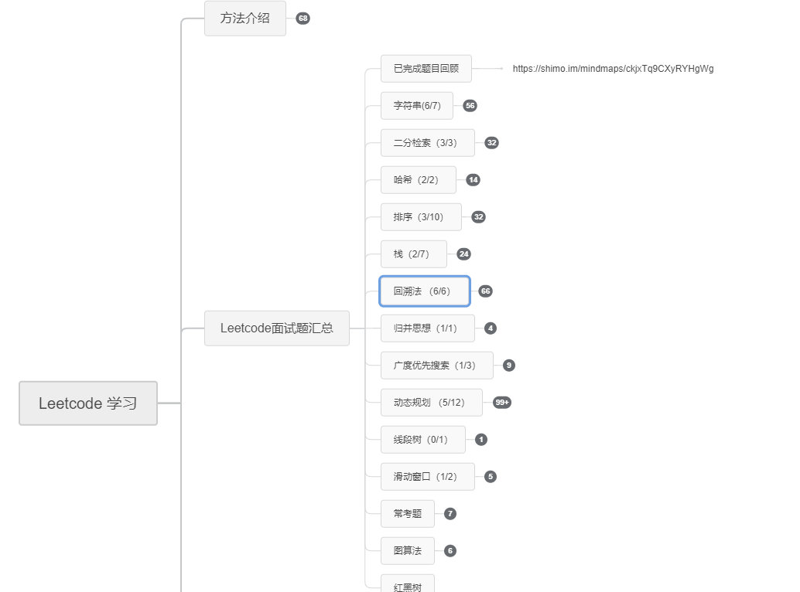

# leetcode Study

## 项目介绍

因为目前正在 找工作需要刷题，为了方便后期学习，我将自己刷过的 题目以及对应的解法记录 于该项目中，方便后期学习，也方便大家学习，如果有帮助，麻烦给个 star , Thank you!

## 题目思维导图

1. [已完成题目思维导图](https://shimo.im/mindmaps/ckjxTq9CXyRYHgWg) 

2. [在做题目思维导图](https://shimo.im/mindmaps/JQWpGvKwWKrWcxTw) 

## 题目汇总

### [以前刷的题目，未加注解](old/)

### [面试题](interview/)

1. [美团 2020 年春招](interview/meituan_interview/)
2. [携程 2020 年春招](interview/ctrip_interview/)

### [简单题](topic1_easy/)
1. [74. 搜索二维矩阵](topic1_easy/T74_searchMatrix/)
2. [88. 合并两个有序数组](topic1_easy/T88_merge/)
3. [136. 只出现一次的数字](topic1_easy/T136_ingleNumber/)
4. [240. 搜索二维矩阵 II](topic1_easy/T240_searchMatrix2/)
### [数组](topic2_arr/)
1. [350. 两个数组的交集 II](topic1_easy/T_select_max_min/)
2. [1. 两数之和](topic1_easy/T1_twoSum/)
3. [56. 合并区间](topic1_easy/T56_merge/)
4. [152. 乘积最大子序列](topic1_easy/T152_maxProduct/)
5. [217. 存在重复元素](topic1_easy/T217_containsDuplicate/)
6. [238. 除自身以外数组的乘积](topic1_easy/T238_productExceptSelf/)
7. [在一个未排序的整型数组中，如何找到最大和最小的数字？](topic1_easy/T268_missingNumber/)
8. [283. 移动零](topic1_easy/T283_moveZeroes/)
9. [287. 寻找重复数](topic1_easy/T287_findDuplicate/)
10. [334. 递增的三元子序列](topic1_easy/T334_increasingTriplet/)
11. [349. 两个数组的交集](topic1_easy/T349_intersection/)
12. [350. 两个数组的交集 II](topic1_easy/T350_intersect/)
13. [836. 矩形重叠](topic1_easy/T836_isRectangleOverlap/)
### [链表](topic3_List/)
**[思路汇总](topic3_List/)**
1. [在未排序链表中，怎样移除重复的节点?](topic3_List/T_removeRepeat/)
2. [在一次遍历中，怎样发现单个链表的中间元素?](topic3_List/T_selectmid/)
3. [链表实现](topic3_List/T0_ListDifine/)
4. [21. 合并两个有序链表](topic3_List/T21_mergeTwoLists/)
5. [141. 环形链表](topic3_List/T141_hasCycle/)
6. [21. 合并两个有序链表](topic3_List/T148_sortList/)
7. [160. 相交链表](topic3_List/T160_getIntersectionNode/)
8. [234. 回文链表](topic3_List/T234_isPalindrome/)
9. [328. 奇偶链表](topic3_List/T328_oddEvenList/)
10. [23. 合并K个排序链表](topic3_List/T23_mergeKLists/)
### [动态规划](topic4_dynamic_planning_study/)
**[思路汇总](topic4_dynamic_planning_study/)**
1. [在未排序链表中，怎样移除重复的节点?](topic4_dynamic_planning_study/0811_waysToChange/)
2. [牛妹的蛋糕](topic4_dynamic_planning_study/NK_cakeNumber/)
3. [887. 鸡蛋掉落](topic4_dynamic_planning_study/T887_superEggDrop/)
4. [0-1背包问题](topic4_dynamic_planning_study/T200322_bestValue/)
5. [322. 零钱兑换](topic4_dynamic_planning_study/T200322_coinChange/)
6. [面试题10- I. 斐波那契数列](topic4_dynamic_planning_study/T200322_ib_study/)
7. [62. 不同路径](topic4_dynamic_planning_study/T200323_uniquePathsWithObstacles/)
8. [63. 不同路径 II](topic4_dynamic_planning_study/T200323_uniquePaths/)
### [字符串](topic5_string/)
**[思路汇总](topic5_string/)**
1. [5. 最长回文子串](topic5_string/T5_longestPalindrome/)
2. [125. 验证回文串](topic5_string/T125_isPalindrome/)
3. [242. 有效的字母异位词](topic5_string/T242_isAnagram/)
4. [387. 字符串中的第一个唯一字符](topic5_string/T387_firstUniqChar/)
5. [466. 统计重复个数](topic5_string/T466_getMaxRepetitions/)
### [栈](topic6_stack/)
**[思路汇总](topic6_stack/)**
1. [150. 逆波兰表达式求值](topic6_stack/T387_firstUniqChar/)
### [排序](topic7_sorted/)
**[思路汇总](topic7_sorted/)**
1. [插入排序](topic7_sorted/T_insert_sorted/)
2. [快速排序](topic7_sorted/T_quick_sort/)
3. [376. 摆动序列](topic7_sorted/T376_wiggleMaxLength/)
### [二分查找](topic8_binary_search/)
**[思路汇总](topic8_binary_search/)**
1. [15. 三数之和](topic8_binary_search/T15_three_sum/)
2. [18. 四数之和](topic8_binary_search/T18_forth_sum/)
3. [33. 搜索旋转排序数组](topic8_binary_search/T33_search/)
4. [162. 寻找峰值](topic8_binary_search/T162_findPeakElement/)
### [哈希表](topic9_hash_table/)
**[思路汇总](topic9_hash_table/)**
1. [171. Excel表列序号](topic9_hash_table/T171_titleToNumber/)
2. [454. 四数相加 II](topic9_hash_table/T454_forth_sum/)
### [队列](topic10_queue/)
**[思路汇总](topic10_queue/)**
1. [239. 滑动窗口最大值](topic10_queue/T239_maxSlidingWindow/)
2. [347. 前 K 个高频元素](topic10_queue/T347_topKFrequent/)
3. [621. 任务调度器](topic10_queue/T621_leastInterval/)
4. [933. 最近的请求次数](topic10_queue/T933_RecentCounter/)
### [堆](topic11_heap/)
**[思路汇总](topic11_heap/)**
1. [堆排序](topic11_heap/T_HeapSort)
2. [215. 数组中的第K个最大元素](topic11_heap/T215_findKthLargest/)
3. [295. 数据流的中位数](topic11_heap/T295_MedianFinder/)
4. [378. 有序矩阵中第K小的元素](topic11_heap/T378_kthSmallest/)
### [回溯法](topic12_backtrack/)
**[思路汇总](topic12_backtrack/)**
1. [22. 括号生成](topic12_backtrack/T22_generateParenthesis/)
2. [46. 全排列](topic12_backtrack/T46_permute/)
3. [79. 单词搜索](topic12_backtrack/T79_exist/)
4. [131. 分割回文串](topic12_backtrack/T131_partition/)
5. [200. 岛屿数量](topic12_backtrack/T200_numIslands/)
6. [212. 单词搜索 II](topic12_backtrack/T212_findWords/)
### [树](topic13_tree/)
**[思路汇总](topic13_tree/)**
1. [树构建](topic13_tree/T_tree)
2. [面试题28. 对称的二叉树](topic13_tree/T28_isSymmetric/)
3. [104. 二叉树的最大深度](topic13_tree/T104_maxDepth/)
4. [110. 平衡二叉树](topic13_tree/T110_isBalanced/)
5. [111. 二叉树的最小深度](topic13_tree/T111_minDepth/)
6. [112. 路径总和](topic13_tree/T112_hasPathSum/)
7. [113. 路径总和 II](topic13_tree/T113_pathSum/)
8. [129. 求根到叶子节点数字之和](topic13_tree/T129_sumNumbers/)
9. [230. 二叉搜索树中第K小的元素](topic13_tree/T230_kthSmallest/)
10. [236. 二叉树的最近公共祖先](topic13_tree/T236_lowestCommonAncestor/)
11. [257. 二叉树的所有路径](topic13_tree/T257_binaryTreePaths/)
12. [297. 二叉树的序列化与反序列化](topic13_tree/T297_Codec/)
13. [563. 二叉树的坡度](topic13_tree/T563_findTilt/)
### [双指针](topic14_two_pointer/)
**[思路汇总](topic14_two_pointer/)**
1. [11. 盛最多水的容器](topic14_two_pointer/T11_maxArea/)
2. [面试题 08.11. 硬币](topic14_two_pointer/T1248_numberOfSubarrays/)
### [归并排序](topic15_merge/)
**[思路汇总](topic15_merge/)**
1. [面试题51. 数组中的逆序对](topic15_merge/TM51_reversePairs/)

leetcode Study 网站：https://leetcode-cn.com/problemset/all/

