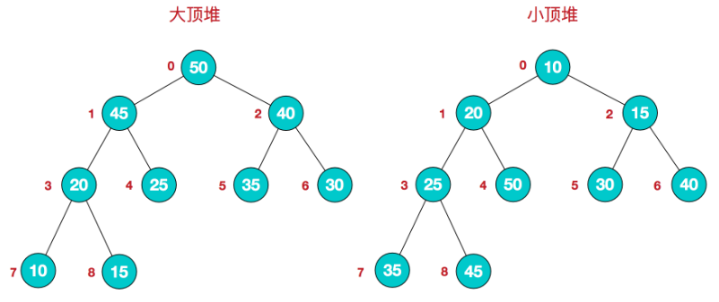
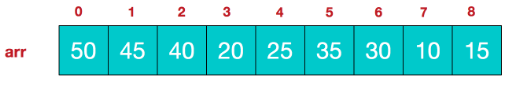
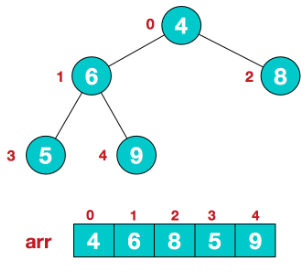
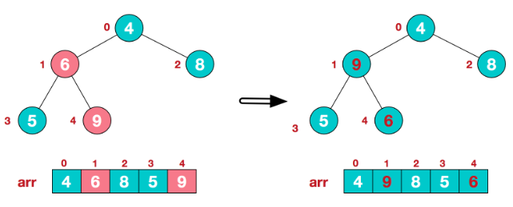
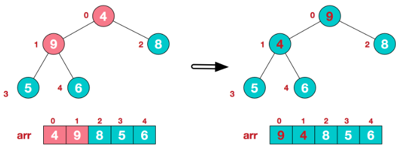
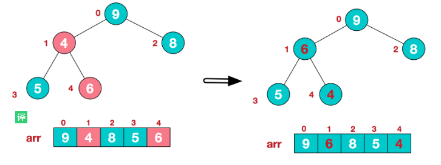
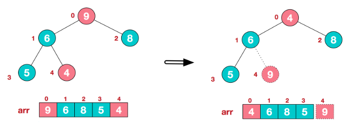
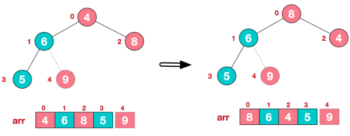
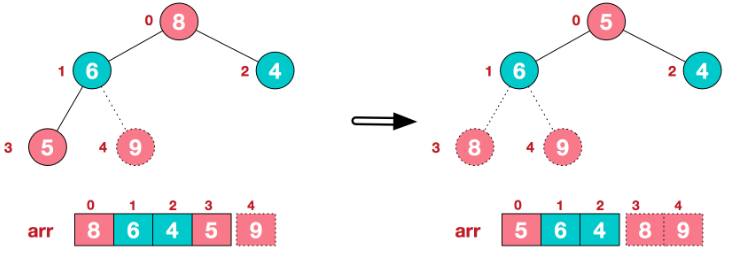
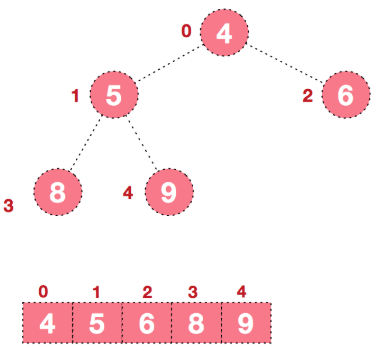

#  堆排序

## 题目描述


## 示例:
```
  
```

## 思路介绍

### 方法

#### 基本介绍

堆是具有以下性质的完全二叉树：每个结点的值都大于或等于其左右孩子结点的值，称为大顶堆；或者每个结点的值都小于或等于其左右孩子结点的值，称为小顶堆。如下图：



同时，我们对堆中的结点按层进行编号，将这种逻辑结构映射到数组中就是下面这个样子



该数组从逻辑上讲就是一个堆结构，我们用简单的公式来描述一下堆的定义就是：

大顶堆：arr[i] >= arr[2i+1] && arr[i] >= arr[2i+2]  

小顶堆：arr[i] <= arr[2i+1] && arr[i] <= arr[2i+2]  

#### 思路

堆排序的基本思想是：将待排序序列构造成一个大顶堆，此时，整个序列的最大值就是堆顶的根节点。将其与末尾元素进行交换，此时末尾就为最大值。然后将剩余n-1个元素重新构造成一个堆，这样会得到n个元素的次小值。如此反复执行，便能得到一个有序序列了

步骤一 构造初始堆。将给定无序序列构造成一个大顶堆（一般升序采用大顶堆，降序采用小顶堆)。

1. 假设给定无序序列结构如下




2. 此时我们从最后一个非叶子结点开始（叶结点自然不用调整，第一个非叶子结点 arr.length/2-1=5/2-1=1，也就是下面的6结点），从左至右，从下至上进行调整。



3. 找到第二个非叶节点4，由于[4,9,8]中9元素最大，4和9交换。



4. 交换导致了子根[4,5,6]结构混乱，继续调整，[4,5,6]中6最大，交换4和6。



此时，我们就将一个无需序列构造成了一个大顶堆。

步骤二 将堆顶元素与末尾元素进行交换，使末尾元素最大。然后继续调整堆，再将堆顶元素与末尾元素交换，得到第二大元素。如此反复进行交换、重建、交换。

1. 将堆顶元素9和末尾元素4进行交换



2. 重新调整结构，使其继续满足堆定义



3. 再将堆顶元素8与末尾元素5进行交换，得到第二大元素8.



4. 后续过程，继续进行调整，交换，如此反复进行，最终使得整个序列有序



再简单总结下堆排序的基本思路：

　　a.将无需序列构建成一个堆，根据升序降序需求选择大顶堆或小顶堆;

　　b.将堆顶元素与末尾元素交换，将最大元素"沉"到数组末端;

　　c.重新调整结构，使其满足堆定义，然后继续交换堆顶元素与当前末尾元素，反复执行调整+交换步骤，直到整个序列有序。

#### 复杂度计算

> 时间复杂度：O(nlogn) 
> 空间复杂度：O(1)

### 参考

1. [图解排序算法(三)之堆排序](https://www.cnblogs.com/chengxiao/p/6129630.html)
2. [堆排序](https://www.runoob.com/w3cnote/heap-sort.html)