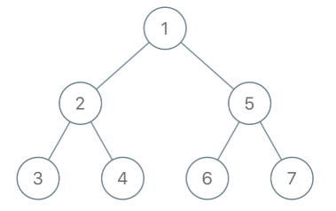
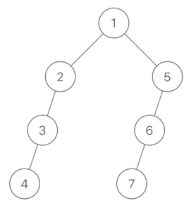
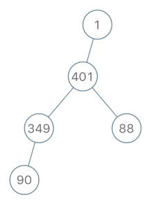

# 980. 不同路径 III

## 题目描述

    1028. 从先序遍历还原二叉树

    我们从二叉树的根节点 root 开始进行深度优先搜索。

    在遍历中的每个节点处，我们输出 D 条短划线（其中 D 是该节点的深度），然后输出该节点的值。（如果节点的深度为 D，则其直接子节点的深度为 D + 1。根节点的深度为 0）。

    如果节点只有一个子节点，那么保证该子节点为左子节点。

    给出遍历输出 S，还原树并返回其根节点 root。

## 示例:
```
  	示例 1：
    输入："1-2--3--4-5--6--7"
    输出：[1,2,5,3,4,6,7]

    示例 2：
    输入："1-2--3---4-5--6---7"
    输出：[1,2,5,3,null,6,null,4,null,7]

    示例 3：
    输入："1-401--349---90--88"
    输出：[1,401,null,349,88,90]
```







## 思路介绍

### 方法一 回溯法

#### 基本介绍

#### 思路

根据题目的重建规则在一个分叉的左节点不为空时深度是一直增加的，一但出现深度降低或不变就是前面某个节点的右节点，显然，我们需要回过头来看访问过的节点的孩子状态，典型的回溯思路，我们以depth表示当前节点的深度，val表示当前节点的值，以"1-2--3--4-5--6--7"为例分析：


首先我们遍历到1，depth是0，显然我们清楚1是根节点，然后是节点2，depth为1，深度增加，必是上一个节点的左孩子，同理3也是2的左孩子。到节点4，这时候depth为2和上一个节点相同，说明3没有子节点，这里有一种情形是要说明的，就是假如3只存在一个子节点，我们是无法通过这个序列得知是它的左孩子还是它的右孩子，题目说明了这种情形，我们一律当成左孩子，只靠一个前序遍历序列是无法恢复二叉树的。回到正题，3没有子节点，那么3后续就不用考虑了，对于同深度的节点我们后续只需要考虑4，这里出现一个现象，我们一但遍历一条路径就直接到头，不会回过头再来，也就是树的深度在增加，我们不需要回溯，但是一但不增加，就代表该路径到头了，我们需要回溯到这个路径上上一个存在其他分叉的节点——也就是depth-1的节点，因为我们事先不知道哪个节点存在多条分叉，所以事先将所有深度的节点都保存了。因此我们可以使用哈希表来更新最新的同深度节点的索引，用深度为键，节点为键值，因为树的深度不会太深所以可用，使用栈的话还要进行额外的入栈和出栈，才可以保证O(1)时间查询到回溯的节点。判定规则：以当前深度的节点替换上一个同深度的节点，构建树时，我们首先会看看depth-1层的节点有没有左孩子，没有的话，根据题目，我们会先构建左孩子，已存在左孩子，那depth对应的节点就是右孩子。我们继续遍历序列看看这个规则的有效性，节点5，depth为1，节点1已经有左孩子了，那5就是右孩子，然后替换depth为1的节点为5，节点6，depth为2，depth为1的节点为5没有左孩子，则节点6是节点5的左孩子，节点7同理。
   
#### 复杂度计算

> 时间复杂度：

> 空间复杂度：

