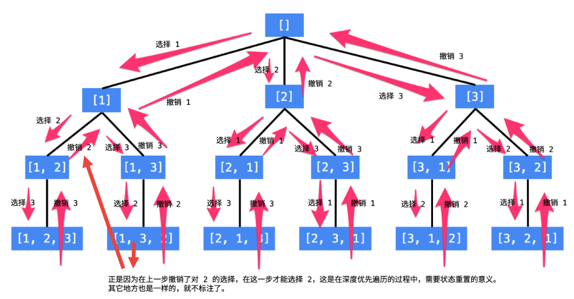

#  46. 全排列

## 题目描述

    给定一个 没有重复 数字的序列，返回其所有可能的全排列。

## 示例:
```
  	输入: [1,2,3]
    输出:
    [
        [1,2,3],
        [1,3,2],
        [2,1,3],
        [2,3,1],
        [3,1,2],
        [3,2,1]
    ]
```

## 思路介绍

### 方法一 回溯法

#### 基本介绍

1. 每一个结点表示了“全排列”问题求解的不同阶段，这些阶段通过变量的“不同的值”体现；
2. 这些变量的不同的值，也称之为“状态”；
3. 使用深度优先遍历有“回头”的过程，在“回头”以后，状态变量需要设置成为和先前一样；
4. 因此在回到上一层结点的过程中，需要撤销上一次选择，这个操作也称之为“状态重置”；
5. 深度优先遍历，可以直接借助系统栈空间，为我们保存所需要的状态变量，在编码中只需要注意遍历到相应的结点的时候，状态变量的值是正确的，具体的做法是：往下走一层的时候，path 变量在尾部追加，而往回走的时候，需要撤销上一次的选择，也是在尾部操作，因此 path 变量是一个栈。
6. 深度优先遍历通过“回溯”操作，实现了全局使用一份状态变量的效果。


#### 思路



1. 判断 nums 是否为 0 ：
   1. 为 0：
      1. 将 path 加入 res ,并 返回；
   2. 不为 0：
      1. 选取 nums 中一个元素，加入 path 中；
      2. 然后对 nums 中 剩余 的 元素 进行深度搜索；

   
#### 复杂度计算

> 时间复杂度：O(n*n!),调用的每个叶结点（共 n! 个），我们需要将当前答案使用 O(n) 的时间复制到答案数组中，相乘得时间复杂度为 O(n * n!)。

> 空间复杂度：O(n),其中 nn 为序列的长度。除答案数组以外，递归函数在递归过程中需要为每一层递归函数分配栈空间，所以这里需要额外的空间且该空间取决于递归的深度，这里可知递归调用深度为 O(n)。


