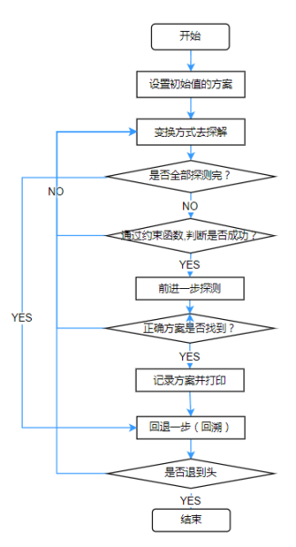

## 回溯法

## 1 算法思想 

回溯法是一种既带有系统性又带有跳跃性的搜索算法。回溯法从开始结点（根结点）出发，以深度优先的方式搜索整个解空间（一般为树结构空间）。这个开始结点就成为一个活结点，同时也成为当前的扩展结点。在当前的扩展结点处，搜索向纵深方向移至一个新结点。这个新结点就成为一个新的活结点，并成为当前的扩展结点。如果在当前的扩展结点处不能再向纵深方向移动，则当前扩展结点就成为死结点。换句话说，这个结点不再是一个活结点，此时，应往回移动（回溯）至最近的一个活结点，并使这个活结点成为当前的扩展结点。回溯法即以这种工作方式递归地在解空间中搜索，直至找到所要求的解或者解空间中已没有活结点时为止。因此，回溯法可以形象地概括为“向前走，破壁回头”。回溯法中，首先需要明确下面三个概念：

1) 剪枝函数：剪枝函数是根据题意定出的。通过描述合法解的一般特征用于去除不合法的解，从而避免继续搜索出这个不合法解的剩余部分。因此，剪枝函数是对于任何状态空间树上的节点都有效、等价的。常见的剪枝函数：
   
    a) 用约束函数在扩展结点处剪去不满足约束的子树；

    b) 用限界函数剪去得不到最优解的子树。

2) 状态空间树：刚刚已经提到，状态空间树是一个对所有解的图形描述。树上的每个子节点的解都只有一个部分与父节点不同；

3) 扩展节点、活结点、死结点：所谓扩展节点，就是当前正在求出它的子节点的节点，在DFS中，只允许有一个扩展节点。活结点就是通过与约束函数的对照，节点本身和其父节点均满足约束函数要求的节点；死结点反之。由此很容易知道死结点是不必求出其子节点的。

## 2 算法求解步骤

利用回溯法解题的具体步骤：

1) 首先，要通过读题完成下面三个步骤：

    a) 描述解的形式，定义一个解空间，它包含问题的所有解；
    
    b) 构造易于搜索的状态空间树；

    c) 以深度优先方式搜索解空间，并在搜索过程中利用剪枝函数避免无效搜索构造约束函数（用于杀死节点）。

2) 然后就要通过DFS思想完成回溯。如图5-2-1所示。完整过程如下：

    a) 设置初始化的方案（给变量赋初值，读入已知数据等）；

    b) 变换方式去试探，若全部试完则转(7)；

    c) 判断此法是否成功（通过约束函数），不成功则转(2)；

    d) 试探成功则前进一步再试探；

    e) 正确方案还未找到则转(2)；

    f) 已找到一种方案则记录并打印；

    g) 退回一步（回溯），若未退到头则转(2)；

    h) 已退到头则结束或打印无解。



## 3 算法适合条件

在实际生活中，会遇到这样一类题目，它的问题可以分解，但是又不能得出明确的动态规划或是递归解法，此时可以考虑用回溯法解决此类问题。回溯法的优点 在于其程序结构明确，可读性强，易于理解，而且通过对问题的分析可以大大提高运行效率。但是，对于可以得出明显的递推公式迭代求解的问题，还是不要用回溯法，因为它花费的时间比较长。

## 4 算法的架构

### 4.1 回溯递归

回溯法对解空间进行深度优先搜索，因此，在一定情况下可用递归方法实现回溯法。

> 回溯递归
``` java
void backtrack(int t){
	if(t>n) output(x);           //记录或输出得到的可行解x
	else 
		for(int i=f(n,t);i<=g(n,t);i++){
			x[t]=h(i);
			if(constraint(t)&&bound(t))  backtrack(t+1);   /*对其子树进行进一步搜索*/
		}
}
```

- 形式参数$t$：表示递归深度，即当前扩展结点在解空间树中的深度；

- 参数$n$：用于控制递归深度；

- 函数$f(n,t)$：表示当前扩展结点处未搜索过的子树的起始编号；

- 函数$g(n,t)$：表示当前扩展结点处未搜索过的子树的终止编号；

- 函数$h(i)$：表示在当前扩展结点处$x[t]$的第$i$个可选值；

- 函数$constraint(t)$：当前扩展结点处的约束函数；

- 函数$bound(t)$：当前扩展结点处的限界函数。

### 4.2 迭代递归

采用树的非递归深度遍历算法，可将回溯法表示为一个非递归迭代过程。

> 迭代递归
``` java
void iterativeBacktrack(){
	int t=1;
	while(t>0){
		if(f(n,t)<=g(n,t)){
			for(int i=f(n,t);i<=g(n,t);i++){
				x[t]=h(i);
				if(constraint(t)&&bound(t))
					if (solution(t)){output(x);}
					else{t++； }
		}else{t--;}
	}
}
``` 
- 函数 $ solution(t)$：判断在当前扩展结点处是否已得到问题的可行解。

用回溯法解题的一个显著特征是在搜索过程中动态产生问题的解空间。在任何时刻，算法只保存从根结点到当前扩展结点的路径。如果解空间树中从根结点到叶子结点的最长路径的长度为$h(n)$，则回溯法所需的计算空间通常为$O(h(n))$。而显式地存储整个解空间则需要$O(2h(n))$或者$O(h(n)!$内存空间。

### 4.3子集树与排列树

1) 子集树

当所给的问题是从n个元素的集合S中找到S满足某种性质的子集时，相应的解空间树称为子集树。遍历子集树的算法需要O(2n)计算时间。用回溯法搜索子集树的一般算法可描述如下。

> 子集树
```java
void backtrack(int t)
{
	if(t>n) output(x);           //记录或输出得到的可行解x
	else 
		for(int i=f(n,t);i<=g(n,t);i++){
			x[t]=h(i);
			if(constraint(t)&&bound(t))   backtrack(t+1);   //对其子树进行进一步搜索
		}
}
``` 

2) 排列树

当所给问题时确定n个元素满足某种性质的排列时，相应的解空间树称为排列树。遍历排列树需要O(n!)计算时间。用回溯法搜索排列树的一般算法可描述如下。

> 排列树
```java
void backtrack(int t){
	if(t>n) output(x);
	else 
		for(int i=t;i<=n;i++){
			swap(x[t],x[i]);
			if(constraint(t)&&bound(t)) backtrack(t+1);
			swap(x[t],x[i]);
		}
}
```