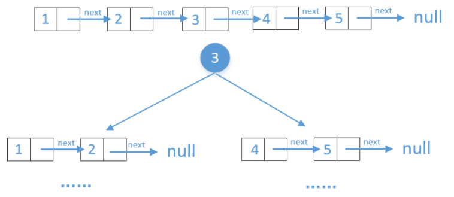

# 109. 有序链表转换二叉搜索树

## 题目描述

   给定一个单链表，其中的元素按升序排序，将其转换为高度平衡的二叉搜索树。

    本题中，一个高度平衡二叉树是指一个二叉树每个节点 的左右两个子树的高度差的绝对值不超过 1。

    示例:

    给定的有序链表： [-10, -3, 0, 5, 9],

    一个可能的答案是：[0, -3, 9, -10, null, 5], 它可以表示下面这个高度平衡二叉搜索树：

      0
     / \
   -3   9
   /   /
 -10  5

## 思路介绍

### 方法: 快慢指针

#### 题目解析

#### 思路

题中说了，是按照升序排列的单链表，我们只需要找到他的中间结点，让他成为树的根节点，中间结点前面的就是根节点左子树的所有节点，中间节点后面的就是根节点右子树的所有节点，然后使用递归的方式再分别对左右子树进行相同的操作……

这里就以链表1→2→3→4→5为例来画个图看一下




### 代码

```python
# Definition for singly-linked list.
# class ListNode:
#     def __init__(self, val=0, next=None):
#         self.val = val
#         self.next = next
# Definition for a binary tree node.
# class TreeNode:
#     def __init__(self, val=0, left=None, right=None):
#         self.val = val
#         self.left = left
#         self.right = right
class Solution:
    # 快慢指针
    def sortedListToBST(self, head: ListNode) -> TreeNode:
        # 边界条件的判断
        if not head:
            return None
        elif not head.next:
            return TreeNode(head.val)
        # 这里通过快慢指针找到链表的中间结点slow，pre就是中间
        slow = head
        fast = head
        # 结点slow的前一个结点
        pre = None
        while fast and fast.next:
            pre = slow
            slow = slow.next
            fast = fast.next.next
        
        # 链表断开为两部分
        # 一部分是node 的左子节点
        # 一部分是node 的右子节点
        pre.next = None
        node = TreeNode(slow.val)
        # node就是当前节点
        node.left = self.sortedListToBST(head)
        # 从head节点到pre节点是node左子树的节点
        node.right = self.sortedListToBST(slow.next)
        return node
```

#### 复杂度计算

> 时间复杂度：O(N)
> 
> 空间复杂度：O(1)

