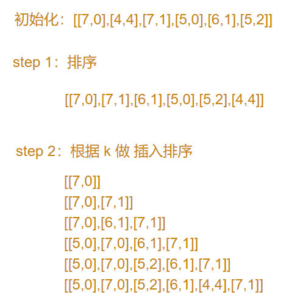

# 406. 根据身高重建队列

## 题目描述

假设有打乱顺序的一群人站成一个队列，数组 people 表示队列中一些人的属性（不一定按顺序）。每个 people[i] = [hi, ki] 表示第 i 个人的身高为 hi ，前面 正好 有 ki 个身高大于或等于 hi 的人。

请你重新构造并返回输入数组 people 所表示的队列。返回的队列应该格式化为数组 queue ，其中 queue[j] = [hj, kj] 是队列中第 j 个人的属性（queue[0] 是排在队列前面的人）。

## 示例:

示例 1：

```s
    输入：people = [[7,0],[4,4],[7,1],[5,0],[6,1],[5,2]]
    输出：[[5,0],[7,0],[5,2],[6,1],[4,4],[7,1]]
    解释：
    编号为 0 的人身高为 5 ，没有身高更高或者相同的人排在他前面。
    编号为 1 的人身高为 7 ，没有身高更高或者相同的人排在他前面。
    编号为 2 的人身高为 5 ，有 2 个身高更高或者相同的人排在他前面，即编号为 0 和 1 的人。
    编号为 3 的人身高为 6 ，有 1 个身高更高或者相同的人排在他前面，即编号为 1 的人。
    编号为 4 的人身高为 4 ，有 4 个身高更高或者相同的人排在他前面，即编号为 0、1、2、3 的人。
    编号为 5 的人身高为 7 ，有 1 个身高更高或者相同的人排在他前面，即编号为 1 的人。
    因此 [[5,0],[7,0],[5,2],[6,1],[4,4],[7,1]] 是重新构造后的队列。
```

示例 2：

```s
    输入：people = [[6,0],[5,0],[4,0],[3,2],[2,2],[1,4]]
    输出：[[4,0],[5,0],[2,2],[3,2],[1,4],[6,0]]
```

提示：

1 <= people.length <= 2000
0 <= hi <= 106
0 <= ki < people.length
题目数据确保队列可以被重建


## 思路介绍

### 方法一：贪心算法

#### 题目解析

假设 数组为 [[h1,k1], [h2,k2],... [hn,kn]]

对于 数组中 的 某个元素 [hi, ki]，hi 表示 这个人的身高，ki 表示 排在这个人前面且身高大于或等于 h 的人数

#### 思路

1. 排序
   1. 按照 h 做 降序排序：按照 h 进行降序排序，对于每个元素，在其之前的元素的个数，就是大于等于他的元素的数量
   2. 按照 k 做 升序排序：按照 k 正向排序，我们希望 k 大的尽量在后面，减少插入操作的次数
2. 根据 k 做 插入排序

#### 举例说明



#### 复杂度计算

> 时间复杂度：O(nlogn + n^2)
>  
> 空间复杂度：O(n)

## 参考

1. [【先排序，再插队】动画演示算法过程，有点小套路](https://leetcode-cn.com/problems/queue-reconstruction-by-height/solution/xian-pai-xu-zai-cha-dui-dong-hua-yan-shi-suan-fa-g/)