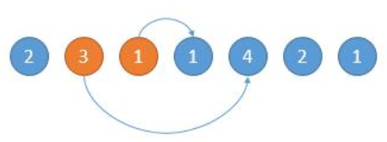
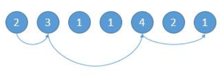

# 45. 跳跃游戏 II

## 题目描述

    给定一个非负整数数组，你最初位于数组的第一个位置。

    数组中的每个元素代表你在该位置可以跳跃的最大长度。

    你的目标是使用最少的跳跃次数到达数组的最后一个位置。

## 示例:
```
   输入: [2,3,1,1,4]
    输出: 2
    解释: 跳到最后一个位置的最小跳跃数是 2。
         从下标为 0 跳到下标为 1 的位置，跳 1 步，然后跳 3 步到达数组的最后一个位置。
```

## 思路介绍

### 方法一：动态规划（超时）

#### 题目解析


#### 思路

1. 定义dp状态 dp[i]表示下标为i的位置最少需要几次跳跃
2. 初始化状态:因为这边涉及到比较 因此对所有的下标位设置一个不可能到达的值 nums.length + 1
3. 状态转移方程: dp[i] = Math.min(dp[j]+1,dp[i]);其中dp[j]表示从下标[0,i)中能够能够走到位置i的所有情况。

#### 复杂度计算

> 时间复杂度：O(n^2)
>  
> 空间复杂度：O(n)

### 方法二：贪心算法（顺藤摸瓜）

#### 题目解析

1. 贪婪算法，我们每次在可跳范围内选择可以使得跳的更远的位置。

#### 思路

1. 定义一个当前能跳的最大距离变量 maxPosition；
2. 定义一个最远距离变量 end;
3. 遍历数组：
   1. 每次在可跳范围内选择可以使得跳的更远的位置

#### 举例说明

如下图，开始的位置是 2，可跳的范围是橙色的。然后因为 3 可以跳的更远，所以跳到 3 的位置。



如下图，然后现在的位置就是 3 了，能跳的范围是橙色的，然后因为 4 可以跳的更远，所以下次跳到 4 的位置。


写代码的话，我们用 end 表示当前能跳的边界，对于上边第一个图的橙色 1，第二个图中就是橙色的 4，遍历数组的时候，到了边界，我们就重新更新新的边界。
   
#### 复杂度计算

> 时间复杂度：O(n)
>  
> 空间复杂度：O(1)

### 方法三：贪心算法（顺瓜摸藤）

#### 题目解析


#### 思路

1. 我们知道最终要到达最后一个位置，然后我们找前一个位置，遍历数组，找到能到达它的位置，离它最远的就是要找的位置。然后继续找上上个位置，最后到了第 0 个位置就结束了。


#### 举例说明

这种想法看起来更简单了，为什么奏效呢？我们可以这样想。



从左到右跳的话，2 -> 3 -> 4 -> 12−>3−>4−>1。

从右到左的话，我们找能跳到 11 的最左边的位置，我们找的只能是 44 或者是 44 左边的。

找到 4 的话，不用说，刚好完美。

如果是中间范围 3 和 4 之间的第 2 个 1 变成了 3，那么这个位置也可以跳到末尾的 1，按我们的算法我们就找到了这个 3，也就是 4 左边的位置。但其实并不影响我们的 steps，因为这个数字是 3 到 4 中间范围的数，左边界 3 也可以到这个数，所以下次找的话，会找到边界 3，或者边界 3 左边的数。 会不会直接找到上个边界 2 呢？不会的，如果找到了上一个边界 2，那么意味着从 2 直接跳到 3 和 4 之间的那个数，再从这个数跳到末尾就只需 2 步了，但是其实是需要 3 步的。
   
#### 复杂度计算

> 时间复杂度：$O(n^2)$
>  
> 空间复杂度：O(1)

## 参考

1. [详细通俗的思路分析，多解法](https://leetcode-cn.com/problems/jump-game-ii/solution/xiang-xi-tong-su-de-si-lu-fen-xi-duo-jie-fa-by-10/)