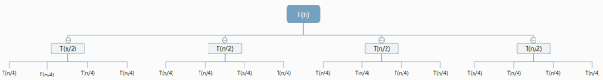

# 分治算法

## 1 算法思想 

分治算法顾名思义“分而治之”，就是把一个复杂的问题分成两个或者更多的相同相似的子问题，再把子问题分成更小的问题……直到最后子问题可以简单的直接求解，原问题的解，即子问题解得合并。如图所示。

## 2 算法求解步骤

分治法求解步骤如下：

1) 分解：将原问题分解成若干个相互独立、与原问题形式相同的子问题；

2) 解决：若干个子问题容易被解决则直接解，否则，再继续分解成更小的子问题，直到容易解决；

3) 合并：将已求解的各个子问题的解，逐个合并以得到原问解。
   
有时问题分解后，不必求解所有的子问题，也就不必做第三步的操作。比如折半查找，在判断出问题的解在某个子问题后，其他的子问题就不必求解，问题的解就是最后（最小）的子问题的解。这种分治法称作“减治法”。

多数问题需要求解所有子问题，并使用恰当的方法合并这些解以得到整个问题的解，比如归并排序，就是不断将子问题中已排好序的解合并成较大规模的有序子集。

## 3 算法适合条件

分治法所能解决的问题一般具有以下几个特征：

1) 该问题的规模缩小到一定的程度就可以容易地解决；

2) 该问题可以分解为若干个规模较小的相同问题，即该问题具有最优子结构性质；

3) 利用该问题分解出的子问题的解可以合并为该问题的解；

4) 该问题所分解出的各个子问题是相互独立的，即子问题之间不包含公共的子子问题。

- 第一条特征是绝大多数问题都可以满足的，因为问题的计算复杂性一般是随着问题规模的增加而增加；

- 第二条特征是应用分治法的前提它也是大多数问题可以满足的，此特征反映了递归思想的应用；

- 第三条特征是关键，能否利用分治法完全取决于问题是否具有第三条特征，如果具备了第一条和第二条特征，而不具备第三条特征，则可以考虑用贪心法或动态规划法；

- 第四条特征涉及到分治法的效率，如果各子问题是不独立的则分治法要做许多不必要的工作，重复地解公共的子问题，此时虽然可用分治法，但一般用动态规划法较好。

