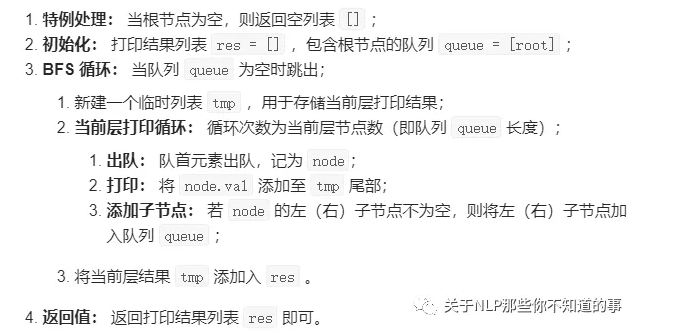

# 126. 剑指 Offer 32 - II. 从上到下打印二叉树 II

## 题目描述

从上到下按层打印二叉树，同一层的节点按从左到右的顺序打印，每一层打印到一行。

 

例如:
给定二叉树: [3,9,20,null,null,15,7],

    3
   / \
  9  20
    /  \
   15   7
返回其层次遍历结果：

[
  [3],
  [9,20],
  [15,7]
]
 

## 思路介绍

### 方法一 广度优先遍历

#### 基本介绍

I. 按层打印：题目要求的二叉树的 从上至下 打印（即按层打印），又称为二叉树的 广度优先搜索（BFS）。BFS 通常借助 队列 的先入先出特性来实现。

II. 每层打印到一行：将本层全部节点打印到一行，并将下一层全部节点加入队列，以此类推，即可分为多行打印。

#### 思路



#### 代码

```s
# Definition for a binary tree node.
# class TreeNode:
#     def __init__(self, x):
#         self.val = x
#         self.left = None
#         self.right = None

class Solution:
    def levelOrder(self, root: TreeNode) -> List[List[int]]:
        '''
            方法二：队列迭代 (非递归)
        '''
        res = []
        if not root:
            return res 
        queue = collections.deque()
        queue.append(root)
        while queue:
            level = []
            for _ in range(len(queue)):
                node = queue.popleft()
                level.append(node.val)
                if node.left:
                    queue.append(node.left)
                if node.right:
                    queue.append(node.right)
            res.append(level)
        return res
        
    def levelOrder1(self, root: TreeNode) -> List[List[int]]:
        '''
            方法一：广度优先搜索 层次遍历法（递归）
        '''
        # step 1：判空
        res = []
        if not root:
            return res
        # step 2：广度优先搜索
        level = 0
        res=self.bfs(root,0,res)
        return res

    # 方法：广度优先搜索
    def bfs(self,root,level,res):
        # step 1：终止条件判断
        if level==len(res):
            res.append([])
        # step 2：先根->左->右
        res[level].append(root.val)
        if root.left:
            self.bfs(root.left,level+1,res)
        if root.right:
            self.bfs(root.right,level+1,res)
        return res
```


#### 复杂度计算

> 时间复杂度：

> 空间复杂度：