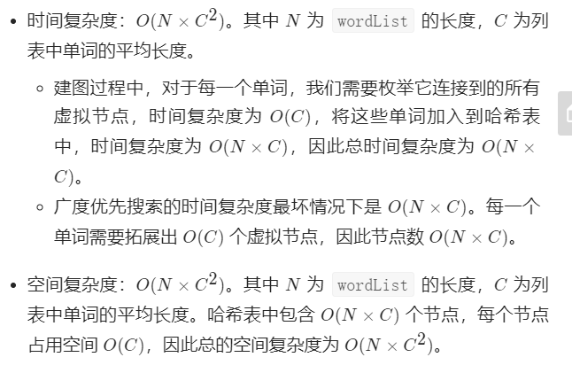

# 127. 单词接龙

## 题目描述

    给定两个单词（beginWord 和 endWord）和一个字典，找到从 beginWord 到 endWord 的最短转换序列的长度。转换需遵循如下规则：

    每次转换只能改变一个字母。
    转换过程中的中间单词必须是字典中的单词。
    说明:

    如果不存在这样的转换序列，返回 0。
    所有单词具有相同的长度。
    所有单词只由小写字母组成。
    字典中不存在重复的单词。
    你可以假设 beginWord 和 endWord 是非空的，且二者不相同。
    

## 示例:
```
    示例 1:

    输入:
        beginWord = "hit",
        endWord = "cog",
        wordList = ["hot","dot","dog","lot","log","cog"]

    输出: 5

    解释: 一个最短转换序列是 "hit" -> "hot" -> "dot" -> "dog" -> "cog",
        返回它的长度 5。
    示例 2:

    输入:
        beginWord = "hit"
        endWord = "cog"
        wordList = ["hot","dot","dog","lot","log"]

    输出: 0

    解释: endWord "cog" 不在字典中，所以无法进行转换。
```

## 思路介绍

### 方法一 广度优先遍历

#### 基本介绍


#### 思路


#### 复杂度计算



### 代码

```s
import collections  
class Solution:
    # 方法一：广度优先搜索 + 优化建图
    def ladderLength1(self, beginWord: str, endWord: str, wordList) -> int:
        '''
            方法一：广度优先搜索 + 优化建图
        '''
        # 添加单词
        def addWord(word):
            if word not in wordId:
                nonlocal nodeNum
                wordId[word] = nodeNum
                nodeNum += 1
        # 添加边
        def addEdge(word):
            # 将 word 添加到 wordId
            addWord(word)
            id1=wordId[word]
            # 添加虚拟节点，并构建相连边
            chars = list(word)
            for i in range(len(chars)):
                tmp=chars[i]
                chars[i]="*"
                newWord = "".join(chars)
                addWord(newWord)
                id2 = wordId[newWord]
                edge[id1].append(id2)
                edge[id2].append(id1)
                chars[i] = tmp
        wordId = dict()
        # 每个节点 与 哪些 节点 相连，即边
        edge = collections.defaultdict(list)
        nodeNum = 0
        # step 1 ：构图
        for word in wordList:
            addEdge(word)
        # 添加 beginWord
        addEdge(beginWord)
        # 检查 endWord 是否在该映射内，若不存在，则输入无解
        if endWord not in wordId:
            return 0
        dis = [float("inf")]*nodeNum
        beginId,endId = wordId[beginWord],wordId[endWord]
        dis[beginId] = 0
        que = collections.deque([beginId])
        while que:
            x = que.popleft()
            if x==endId:
                return dis[endId]//2+1
            for it in edge[x]:
                if dis[it]==float("inf"):
                    dis[it] = dis[x]+1
                    que.append(it)
        return 0
    # 方法二：双向广度优先搜索
    def ladderLength(self, beginWord: str, endWord: str, wordList) -> int:
        '''
            方法二：双向广度优先搜索
        '''
        # 添加单词
        def addWord(word):
            if word not in wordId:
                nonlocal nodeNum
                wordId[word] = nodeNum
                nodeNum += 1
        # 添加边
        def addEdge(word):
            # 将 word 添加到 wordId
            addWord(word)
            id1=wordId[word]
            # 添加虚拟节点，并构建相连边
            chars = list(word)
            for i in range(len(chars)):
                tmp=chars[i]
                chars[i]="*"
                newWord = "".join(chars)
                addWord(newWord)
                id2 = wordId[newWord]
                edge[id1].append(id2)
                edge[id2].append(id1)
                chars[i] = tmp
        wordId = dict()
        # 每个节点 与 哪些 节点 相连，即边
        edge = collections.defaultdict(list)
        nodeNum = 0
        # step 1 ：构图
        for word in wordList:
            addEdge(word)
        # 添加 beginWord
        addEdge(beginWord)
        # 检查 endWord 是否在该映射内，若不存在，则输入无解
        if endWord not in wordId:
            return 0
        disBegin = [float("inf")]*nodeNum
        beginId = wordId[beginWord]
        disBegin[beginId]=0
        queBegin = collections.deque([beginId])

        disEnd = [float("inf")]*nodeNum
        endId = wordId[endWord]
        disEnd[endId] = 0
        queEnd = collections.deque([endId])
        while queBegin or queEnd:
            queBeginSize = len(queBegin)
            for _ in range(queBeginSize):
                nodeBegin = queBegin.popleft()
                if disEnd[nodeBegin]!=float("inf"):
                    return (disBegin[nodeBegin]+disEnd[nodeBegin])//2+1
                for it in edge[nodeBegin]:
                    if disBegin[it]==float("inf"):
                        disBegin[it] = disBegin[nodeBegin]+1
                        queBegin.append(it)
            
            queEndSize = len(queEnd)
            for _ in range(queEndSize):
                nodeEnd = queEnd.popleft()
                if disBegin[nodeEnd]!=float("inf"):
                    return (disBegin[nodeEnd]+disEnd[nodeEnd])//2+1
                for it in edge[nodeEnd]:
                    if disEnd[it] == float("inf"):
                        disEnd[it]=disEnd[nodeEnd]+1
                        queEnd.append(it)
        return 0


if __name__ == '__main__':
    beginWord = "hit"
    endWord = "cog"
    wordList = ["hot", "dot", "dog", "lot", "log", "cog"]

    solution = Solution()
    res = solution.ladderLength(beginWord, endWord, wordList)
    print(res)
```
