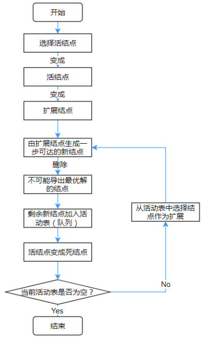

# 分支限界法

## 1 算法思想 

分支限界法常以广度优先或以最小耗费（最大效益）优先的方式搜索问题的解空间树。在分支限界法中，每一个活结点只有一次机会成为扩展结点。活结点一旦成为扩展结点，就一次性产生其所有儿子结点。在这些儿子结点中，导致不可行解或导致非最优解的儿子结点被舍弃，其余儿子结点被加入活结点表中。此后，从活结点表中取下一结点成为当前扩展结点，并重复上述结点扩展过程。这个过程一直持续到找到所需的解或活结点表为空时为止。

宽度优先的问题状态生成法：在一个扩展结点变成死结点之前，它一直是扩展结点。

常见的两种分支限界法：

1) 队列式(FIFO)分支限界法

按照队列先进先出（FIFO）原则选取下一个节点为扩展节点，即活结点队列的组织是按照先来后到的原则进行排队的。 

1) 优先队列式分支限界法

按照优先队列中规定的优先级选取优先级最高的节点成为当前扩展节点，即活结点队列的组织是按照活结点的优先级的大小进行排队的。
堆是实现优先队列的一种很好方法，用小顶堆可以实现最小优先队列；用大顶堆可以实现最大优先队列。

## 2 算法求解步骤

1) 定义解空间；

2) 确定解空间的树结构；

3) 按BFS方式搜索（如图6-2-1所示）：

    a) 每个活结点仅有一次机会变成扩展结点；

    b) 由扩展结点生成一步可达的新结点；

    c) 在新结点中，删除不可能导出最优解的结点，即限界策略；

    d) 将剩余的新结点加入活动表（队列）中；

    e) 从活动表中选择结点作为扩展，分支策略；

    f) 直至活动表为空。

> BFS方式搜索流程图

## 3 算法适合条件

在实际生活中，会遇到这样一类题目，它的问题可以分解，但是又不能得出明确的动态规划或是递归解法，此时可以考虑用分支限界法解决此类问题。分支限界法的优点在于其程序结构明确，可读性强，易于理解，而且通过对问题的分析可以大大提高运行效率。但是，对于可以得出明显的递推公式迭代求解的问题，还是不要用分支限界法，因为它花费的时间比较长。

## 4 回溯法与分支限界法的比较

1) 搜索模型的不同

    a) 回溯使用递归栈作为辅助，按既定顺序逐条搜索每一条从树根到叶子的路径；

    b) 分支限界法使用优先级队列作为辅助，寻找“最优”路径。

2) 目标不同：回溯法更为通用，而分支限界法用于寻找最优解。

3) 时间效率：单就搜索最优解问题。

    a) 回溯法搜索的时间正比于搜索解空间的大小；

    b) 分支限界法的时间敏感于最优解所在位置，当最优解偏树根，则时间相对于搜索整个解空间树非常少。

4) 空间效率

    a) 回溯法的空间消耗与解空间（最大）树高有关；

    b) 分支限界法的空间消耗一般表现出广度优先搜索的特点，与解空间的宽度有关。
