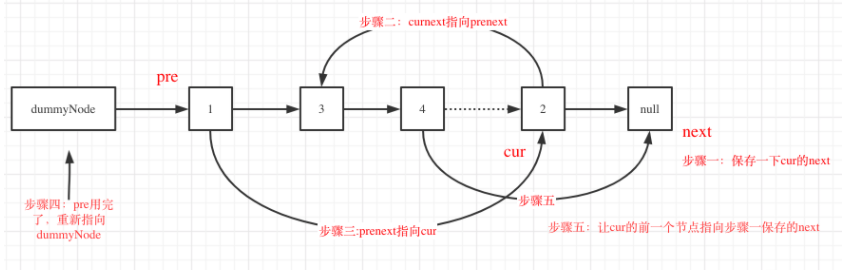

# 147. 对链表进行插入排序

    插入排序的动画演示如上。从第一个元素开始，该链表可以被认为已经部分排序（用黑色表示）。
    每次迭代时，从输入数据中移除一个元素（用红色表示），并原地将其插入到已排好序的链表中。

    插入排序算法：

    

    插入排序是迭代的，每次只移动一个元素，直到所有元素可以形成一个有序的输出列表。
    每次迭代中，插入排序只从输入数据中移除一个待排序的元素，找到它在序列中适当的位置，并将其插入。
    重复直到所有输入数据插入完为止。
     
    示例 1：
        输入: 4->2->1->3
        输出: 1->2->3->4
    示例 2：
        输入: -1->5->3->4->0
        输出: -1->0->3->4->5

## 思路介绍

### 方法一：三指针

#### 题目解析


#### 思路

- step 1：判空，对于空链表和单个节点的链表，可以直接返回
- step 2：创建虚拟头节点
- step 3：初始化 位置
- step 4：如果已排好序的链表最后一个节点值 小于 当前节点的值 的情况
    1. 的链表最后一个节点 往后移动一位 
- step 5：如果已排好序的链表最后一个节点值 大于 当前节点的值 的情况
    - step 6：寻找 last 的 前驱节点
    - step 7：核心，改变顺序，建议纸上画一下

- step 8：curr 指向 last 后面 一个节点

#### 代码

```s
import sys
sys.path.append("..") # 这句是为了导入_config
from T0_ListDifine.tools import arr2List,print_list,ListNode
import math
class Solution:
    def insertionSortList(self, head: ListNode) -> ListNode:
        '''
            方法：三指针法
            思路：
                step 1：判空，对于空链表和单个节点的链表，可以直接返回
                step 2：创建虚拟头节点
                step 3：初始化 位置
                step 4：如果已排好序的链表最后一个节点值 小于 当前节点的值 的情况
                    1. 的链表最后一个节点 往后移动一位 
                step 5：如果已排好序的链表最后一个节点值 大于 当前节点的值 的情况
                    step 6：寻找 last 的 前驱节点
                    step 7：核心，改变顺序，建议纸上画一下
                step 8：curr 指向 last 后面 一个节点
            复杂度：
                时间：O(n^2)
                空间：O(1)   
        '''
        # step 1：判空，对于空链表和单个节点的链表，可以直接返回
        if not head or not head.next:
            return head 
        # step 2：创建虚拟头节点
        pre_head = ListNode(0)
        pre_head.next = head 
        # step 3：初始化 位置
        last = head        # 已排好序的链表的最后一个节点
        curr = head.next   # 当前节点
        while curr:
            # step 4：如果已排好序的链表最后一个节点值 小于 当前节点的值 的情况
            if last.val<=curr.val:
                last = last.next 
            # step 5：如果已排好序的链表最后一个节点值 大于 当前节点的值 的情况
            else:
                # step 6：寻找 last 的 前驱节点
                pre = pre_head
                while pre.next.val <= curr.val:
                    pre = pre.next
                # step 7：核心，改变顺序，建议纸上画一下
                pre.next = curr.next 
                curr.next = pre.next 
                pre.next = curr 
            # step 8：curr 指向 last 后面 一个节点
            curr = last.next
        return pre_head.next

if __name__ == "__main__":
    l1 = arr2List([4,2,1,3])
    print_list(l1)
    solution = Solution()
    res = solution.insertionSortList(l1)
    print_list(res)
```

#### 复杂度计算

> 时间复杂度： O(n^2)
> 
> 空间复杂度： O(1)


