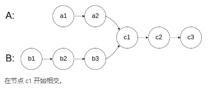

# 160. 相交链表

## 题目描述

    编写一个程序，找到两个单链表相交的起始节点。

    如下面的两个链表：
    节点 c1 开始相交。

    

## 示例:
```
    示例 1：
        输入：intersectVal = 8, listA = [4,1,8,4,5], listB = [5,0,1,8,4,5], skipA = 2, skipB = 3
        输出：Reference of the node with value = 8
        输入解释：相交节点的值为 8 （注意，如果两个列表相交则不能为 0）。从各自的表头开始算起，链表 A 为 [4,1,8,4,5]，链表 B 为 [5,0,1,8,4,5]。在 A 中，相交节点前有 2 个节点；在 B 中，相交节点前有 3 个节点。
         
    示例 2：
        输入：intersectVal = 2, listA = [0,9,1,2,4], listB = [3,2,4], skipA = 3, skipB = 1
        输出：Reference of the node with value = 2
        输入解释：相交节点的值为 2 （注意，如果两个列表相交则不能为 0）。从各自的表头开始算起，链表 A 为 [0,9,1,2,4]，链表 B 为 [3,2,4]。在 A 中，相交节点前有 3 个节点；在 B 中，相交节点前有 1 个节点。
     
    示例 3：
        输入：intersectVal = 0, listA = [2,6,4], listB = [1,5], skipA = 3, skipB = 2
        输出：null
        输入解释：从各自的表头开始算起，链表 A 为 [2,6,4]，链表 B 为 [1,5]。由于这两个链表不相交，所以 intersectVal 必须为 0，而 skipA 和 skipB 可以是任意值。
        解释：这两个链表不相交，因此返回 null。
```

## 思路介绍

### 方法一 字典法

#### 题目解析

1. 因为 两个链表在 某个 节点 处 相交，也就是说有 公共点，该问题 的 核心 就是 要 找到 这个 公共点

#### 思路

1. 定义 一个 字典 a_dict；
2. 遍历 列表 a,然后将逐个 元素 加入 字典 中；
3. 遍历 字典 b, 判断 当前节点算法存在于 字典，若存在 即为 公共点

#### 复杂度计算

> 时间复杂度： O(max(a,b))
> 
> 空间复杂度： O(a)

### 方法二 双指针法

#### 题目解析

1. 因为 两个链表在 某个 节点 处 相交，也就是说有 公共点，该问题 的 核心 就是 要 找到 这个 公共点

#### 思路

1. 计算 两个 列表 的 长度 a_len，b_len；
2. 比较 a_len 和 b_len；
3. 遍历长列表，直到两列表一样长
4. 遍历 a 和 b，若 出现 相同点，则为 公共点

#### 复杂度计算

> 时间复杂度： O(max(a,b))
> 
> 空间复杂度： O(1)
