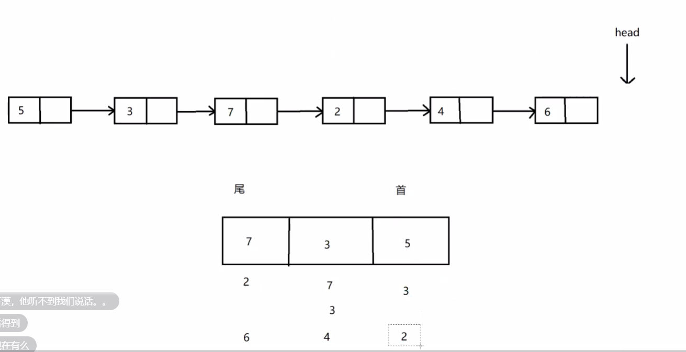
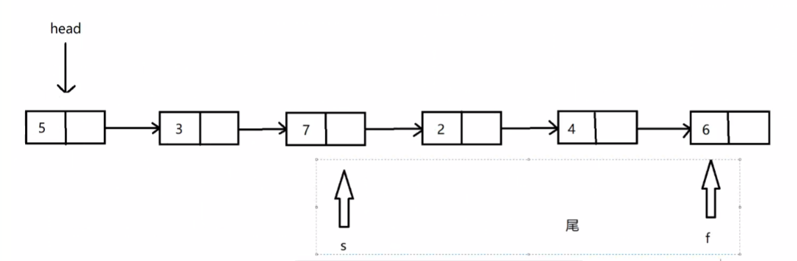
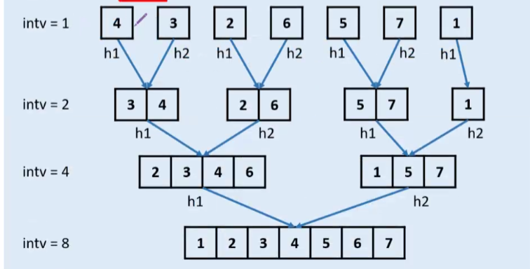
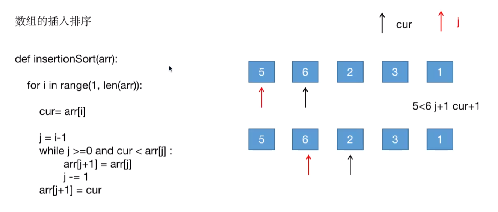
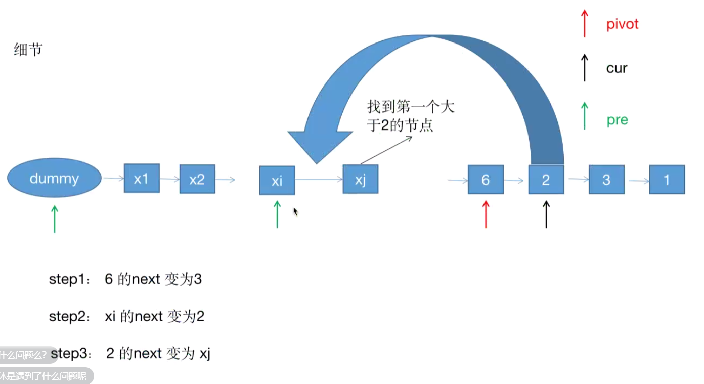
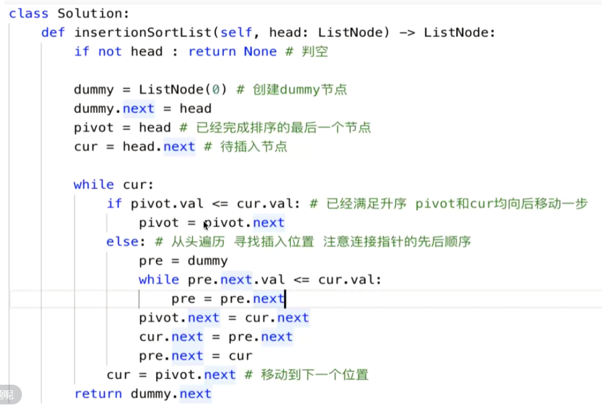

# 2020/11/29

`topic` 链表

## 1. 剑指offer 22.返回倒数第k个节点：林伟龙 【20:15-20:34】

### 方法一

#### 思路

1. 遍历第一次链表计算链表长度
2. 遍历第二次链表找到 第 k 个 元素 

### 方法二 队列

#### 思路

1. 声明 长度为 k 的 队列
2. 然后在 链表上移动，直到头指针 指到 Null，此时队尾即为 倒数第k个节点

### 方法三 固定间距指针

#### 思路

1. 定义 两个指针 l，r
2. l 先走 k 步；
3. 然后 l，r 同步 移动 

## 2. 21.合并两个有序链表：怡神 【20:35-20:43】

### 方法一 递归

### 方法二 双指针

## 3. 148.排序链表：左同斌 【20:45-20:58】

### 归并排序

### 遇到问题

1. 最后 长度不够的问题【判断结束问题】

## 4. 147.对链表进行插入排序：王盟 [20:58-21:06]

### 数组的插入排序

### 链表插入排序

## 5. 25.K个一组翻转链表：楚神 [21:06-21:22]

### 方法一

1. 变量定义
2. 计数，判断是否有 k 个节点可供翻转
3. 若 存在 k 个节点，则可以翻转
   1. 利用 头插法 翻转 k 个 节点

# 2020/4/4
`topic` 链表

>   复杂度格式: 时间复杂度, 空间复杂度

### `leetcode21`: 合并两个有序链表
* 最优解: O(m+n), O(1):
    新建链表,同时遍历两个链表并将较小的结点插入新链表。
    直到一个链表遍历完成，然后将另一个链表剩余的部分接到新链表的末尾。

### `leetcode141`: 环形链表

*   最优解: O(n), O(1)两个在操场上快跑慢跑的人一定会相遇。
  快慢指针。只能输出是否相遇，不能输出具体位置。
*   其他: 
    1.  哈希表。 O(n), O(n)。使用一个哈希表存放已遍历的节点地址，如果发现当前地址已存在则返回true。

### `leetcode160`: 相交链表

*   最优解: O(n+m) O(1) 
  
    1.  A链表走到尾结点的时候从B链表头开始走，直到相交的地方他们重叠。
    
        i, j 
    
    2.  将较长的链表头部多出来的部分切掉，设置两个指针同时遍历两个链表，判断结点是否相同。O(max(n, m))
    
        ​    1->2>3->4   m		a+c
        ​     5->3->4       n		 b+c
*   其他:
    1.  哈希/字典 O(n+m), O(n)将a中的元素存放在字典中，遍历链表b，查找元素在a中是否存在。
    2.  栈 O(n+m), O(n+m) : 使用两个栈存储两个链表的结点，然后循环取栈顶元素进行比较，若两结点不相等，则上次pop出来的结点就是相交点。

### `leetcode234`: 回文链表

*   最优解: O(n), O(1) 
    反转半个链表，并比较前半个和后半个链表。

    1->2->3->3->2->1
    1->2->3-><-3<-2<-1
    ↑								  ↑

    1->2->3<-2<-1

    需要加锁。
    
*   其他: 

    1.   用O(n)的其他数据结构存储链表。

### 怎样查找单个链表的中间元素

*   最优解: O(n), O(1): 快慢指针。

*   其他:

    1.  用O(n)的其他数据结构存储链表。

    ### 