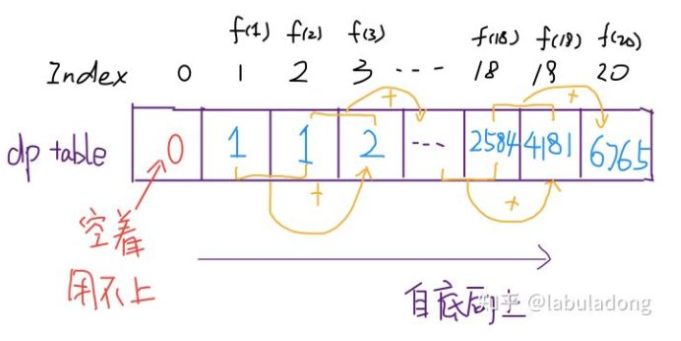

# 面试题10- I. 斐波那契数列

## 题目描述

    
写一个函数，输入 n ，求斐波那契（Fibonacci）数列的第 n 项。斐波那契数列的定义如下：
```
	F(0) = 0,   F(1) = 1
	F(N) = F(N - 1) + F(N - 2), 其中 N > 1.
```

斐波那契数列由 0 和 1 开始，之后的斐波那契数就是由之前的两数相加而得出。

答案需要取模 1e9+7（1000000007），如计算初始结果为：1000000008，请返回 1。

## 示例:
```
    示例 1：

	输入：n = 2
	输出：1

	示例 2：

	输入：n = 5
	输出：5
```

## 思路介绍

### 方法一：递归法

#### 题目解析

1. 题目 翻译

#### 思路

1. 这个递归树怎么理解？就是说想要计算原问题 f(20)，我就得先计算出子问题 f(19) 和 f(18)，然后要计算 f(19)，我就要先算出子问题 f(18) 和 f(17)，以此类推。最后遇到 f(1) 或者 f(2) 的时候，结果已知，就能直接返回结果，递归树不再向下生长了。

#### 复杂度计算

> 时间复杂度： O(2^n)
> 
> 空间复杂度： O(1)

### 方法二：动态规划 1

#### 题目解析

1. 先看看递归法



2. 利用 数组  代替 函数 递归

```
	F[0] = 0,   F[1] = 1
	F[N] = F[N - 1] + F[N - 2], 其中 N > 1.
```

3. 该方程即为 状态转移方程

#### 思路


#### 复杂度计算

> 时间复杂度： O(n)
> 
> 空间复杂度： O(n)


### 方法三：动态规划 2

#### 题目解析

1. 这道题 的 关键 就是 要保存  前两个 元素 的值，那么我们只要 定义 前两步元素 的 值 pre2 和 前一步 的 元素 值 pre1，然后 在 计算 当前 值 是 对 pre2 + pre1 相加，然后 再将 前一步 元素 pre1 赋值 给 前两步 pre2，当前 值 赋值 给 前一步 值 pre1 即可。

#### 复杂度计算

> 时间复杂度： O(n)
> 
> 空间复杂度： O(1)