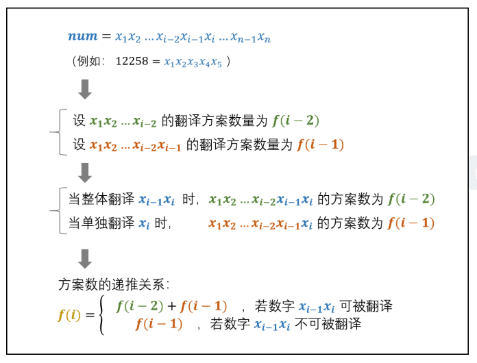
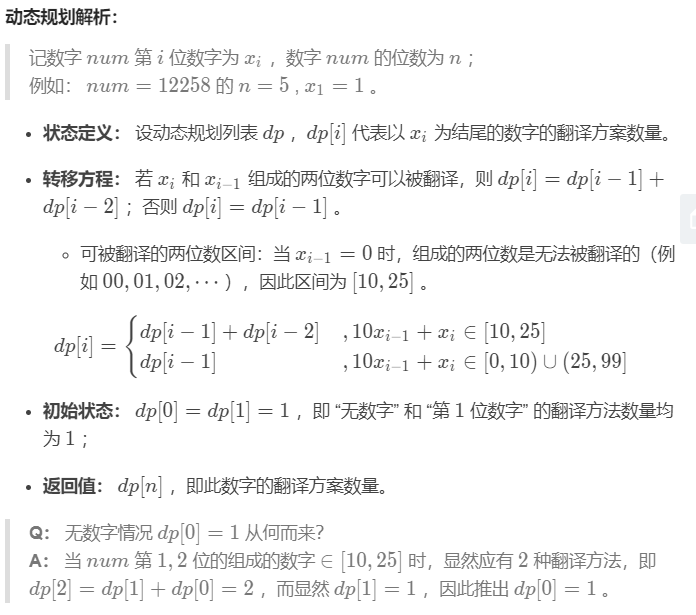

# 面试题46. 把数字翻译成字符串

## 题目描述

    给定一个数字，我们按照如下规则把它翻译为字符串：0 翻译成 “a” ，1 翻译成 “b”，……，11 翻译成 “l”，……，25 翻译成 “z”。一个数字可能有多个翻译。请编程实现一个函数，用来计算一个数字有多少种不同的翻译方法。

## 示例:
```
   示例 1:
        输入: 12258
        输出: 5
        解释: 12258有5种不同的翻译，分别是"bccfi", "bwfi", "bczi", "mcfi"和"mzi"
     
    提示：
        0 <= num < 231
```

## 思路介绍

### 方法一：动态规划

#### 题目解析

#### 思路





#### 复杂度计算

> 时间复杂度：O(n)
>  
> 空间复杂度：O(n)

