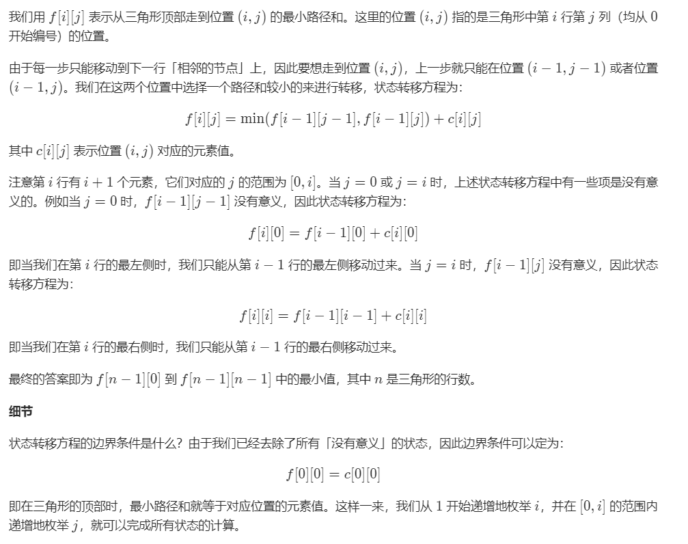

# 120. 三角形最小路径和

## 题目描述

    给定一个三角形，找出自顶向下的最小路径和。每一步只能移动到下一行中相邻的结点上。

    相邻的结点 在这里指的是 下标 与 上一层结点下标 相同或者等于 上一层结点下标 + 1 的两个结点。

    例如，给定三角形：

    [
        [2],
        [3,4],
        [6,5,7],
        [4,1,8,3]
    ]

## 思路介绍

### 方法一：动态规划

#### 思路

#### 复杂度计算

> 时间复杂度： O(n^2)
> 
> 空间复杂度： O(n^2)

