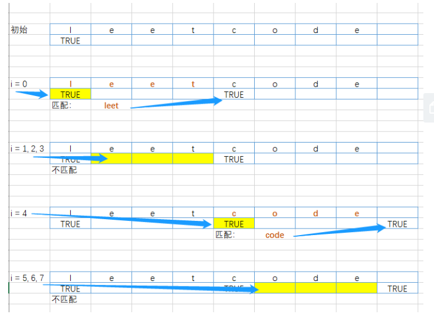

# 139. 单词拆分

## 题目描述

    给定一个非空字符串 s 和一个包含非空单词列表的字典 wordDict，判定 s 是否可以被空格拆分为一个或多个在字典中出现的单词。

    说明：

    拆分时可以重复使用字典中的单词。
    你可以假设字典中没有重复的单词。
    
## 示例:
```
   示例 1：

    输入: s = "leetcode", wordDict = ["leet", "code"]
    输出: true
    解释: 返回 true 因为 "leetcode" 可以被拆分成 "leet code"。
    示例 2：

    输入: s = "applepenapple", wordDict = ["apple", "pen"]
    输出: true
    解释: 返回 true 因为 "applepenapple" 可以被拆分成 "apple pen apple"。
         注意你可以重复使用字典中的单词。
    示例 3：

    输入: s = "catsandog", wordDict = ["cats", "dog", "sand", "and", "cat"]
    输出: false

```

## 思路介绍

### 方法一：动态规划

#### 题目解析


#### 思路

1. 定义一个 长度为 s_len + 1 的状态数组 s_flag_list，用于记录每个位置是否可以被表示，s_flag_list[i] 表示 s 的前 i 位是否可以用wordDict中的单词表示。
2. s_flag_list[0] = True;
3. i -> [0,s_len]:
   1. j -> [i+1,s_len+1]:
      1. 若 s_flag_list[i] 为 True 和 s[i:j] 在 词典 中 时，说明 s 的 前 j 位可以 被表示



#### 复杂度计算

> 时间复杂度：$O(n^2)$
>  
> 空间复杂度：O(n)

