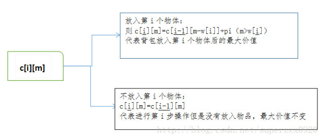

# 0-1背包问题

## 题目描述
    
    有一个背包，他的容量为C(Capacity)。现在有n中不同的物品，编号为0…n-1，其中每一件物品的重量为w(i)，价值为v(i)。问可以向这个背包中盛放哪些物品，使得在不超过背包容量的基础上，物品的总价值最大。

## 示例:
```
    n=5  
    c=10  
    w=[2,2,6,5,4]  
    p=[6,3,5,4,6] 

	output:
		最大价值：15 
		物品：1，2，5
```

## 思路介绍

### 方法一：动态规划

#### 题目解析


#### 思路

先将原始问题一般化，欲求背包能够获得的总价值，即欲求前i个物体放入容量为m（kg）背包的最大价值c[i][m]——使用一个数组来存储最大价值，当m取10，i取3时，即原始问题了。而前i个物体放入容量为m（kg）的背包，又可以转化成前(i-1)个物体放入背包的问题。

状态转移方程

c[i][m]=max{c[i-1][m-w[i]]+p[i]（m>w[i]） , c[i-1][m]}



#### 参数定义

> w[i]：第i个物体的重量
> 
> p[i]：第i个物体的价值
> 
> c[i][j]：前i个物体放入容量为j 包的最大价值
> 
> c[i-1][j]：前i个物体放入容量为j 包的最大价值
> 
> c[i-1][j-w[i]]：前i-1个物体放入容量为j-w[i] 包的最大价值

#### 复杂度计算

> 时间复杂度： O(m^c)
> 
> 空间复杂度： O(m^c)

