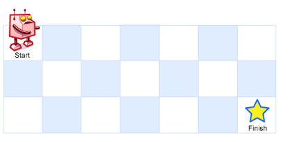

# 63. 不同路径 II

## 题目描述

一个机器人位于一个 m x n 网格的左上角 （起始点在下图中标记为“Start” ）。

机器人每次只能向下或者向右移动一步。机器人试图达到网格的右下角（在下图中标记为“Finish”）。

现在考虑网格中有障碍物。那么从左上角到右下角将会有多少条不同的路径？



网格中的障碍物和空位置分别用 1 和 0 来表示。

说明：m 和 n 的值均不超过 100。


## 示例:
```
    示例 1:
		输入:
		[
		  [0,0,0],
		  [0,1,0],
		  [0,0,0]
		]
		输出: 2
		解释:
		3x3 网格的正中间有一个障碍物。
		从左上角到右下角一共有 2 条不同的路径：
		1. 向右 -> 向右 -> 向下 -> 向下
		2. 向下 -> 向下 -> 向右 -> 向右

```

## 思路介绍

### 方法一：动态规划法

#### 题目解析

1. 这道题 和 不同路径 I 的区别在于，这道题添加了 障碍，所以机器人在运行时，需要避开 这些 障碍。

#### 思路

1. 由 前面问题解析，可以知道，当前 位置 的 方法数 主要来源于以下两种可能：
   1.  上边空格 和 左边空格 的 方法数 之和，即 可以知道状态方程：

	```
		dp[i][j] = dp[i-1][j] + dp[i][j-1]
	```
	2. 当前这个格子 为障碍，那么，将不能通行，此时，状态方程：
    ```
		dp[i][j] = 0
	```

2. 有两个个问题：
   1. 对于 第一行 ，当前格子有两种可能：
      1. 若格子为障碍，那么 该值 为 0
      2. 若格子可以走，它如果 从 第一行前一列 移动过来，所以 它 的方法数只能为 1；
   2. 对于 第一列 ，当前格子有两种可能：
      1. 若格子为障碍，那么 该值 为 0
      2. 若格子可以走，它只能 从 第一列前一行 移动过来，所以 它 的方法数只能为 1；
   
	因此，对应 的 初始状态方程为:

```
	dp[0][j] = dp[i][0] = 1 or 0(障碍) , i in [0,m] , j in [0,n]
```

#### 复杂度计算

> 时间复杂度： O(m*n)
> 
> 空间复杂度： O(1) （因为 题目 所给指针 能够 被重用，所以不用重新申请空间）

