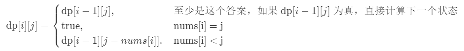
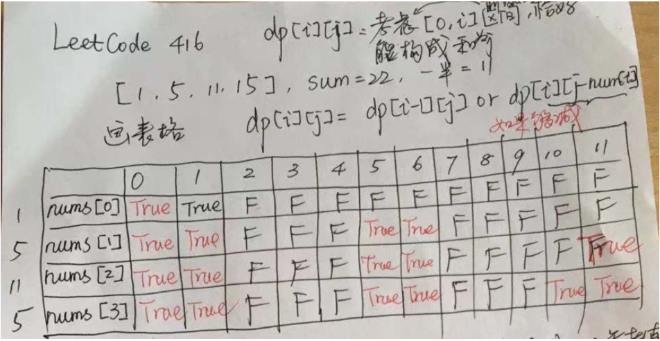

# 416. 分割等和子集

## 题目描述

    给定一个只包含正整数的非空数组。是否可以将这个数组分割成两个子集，使得两个子集的元素和相等。

    注意:

    每个数组中的元素不会超过 100
    数组的大小不会超过 200
    
## 示例:
```
   示例 1:

    输入: [1, 5, 11, 5]

    输出: true

    解释: 数组可以分割成 [1, 5, 5] 和 [11].
     

    示例 2:

    输入: [1, 2, 3, 5]

    输出: false

    解释: 数组不能分割成两个元素和相等的子集.

```

## 思路介绍

### 方法一：动态规划 (0-1 背包问题)

#### 题目解析

切入点：是否可以从这个数组中挑选出一些正整数，使得这些数的和等于整个数组元素的和的一半。前提条件是：数组的和一定得是偶数，即数组的和一定得被 22 整除，这一点是特判。

#### 思路

画一个 len 行，target + 1 列的表格。这里 len 是物品的个数，target 是背包的容量。len 行表示一个一个物品考虑，target + 1多出来的那 1 列，表示背包容量从 0 开始，很多时候，我们需要考虑这个容量为 0 的数值。

- 状态定义：dp[i][j]表示从数组的 [0, i] 这个子区间内挑选一些正整数，每个数只能用一次，使得这些数的和恰好等于 j。
- 状态转移方程：很多时候，状态转移方程思考的角度是“分类讨论”，对于“0-1 背包问题”而言就是“当前考虑到的数字选与不选”。

1、不选择 nums[i]，如果在 [0, i - 1] 这个子区间内已经有一部分元素，使得它们的和为 j ，那么 dp[i][j] = true；

2、选择 nums[i]，如果在 [0, i - 1] 这个子区间内就得找到一部分元素，使得它们的和为 j - nums[i]。

状态转移方程是：

$$
    dp[i][j] = dp[i - 1][j] or dp[i - 1][j - nums[i]]
$$

一般写出状态转移方程以后，就需要考虑边界条件（一般而言也是初始化条件）。

1、j - nums[i] 作为数组的下标，一定得保证大于等于 0 ，因此 nums[i] <= j；
2、注意到一种非常特殊的情况：j 恰好等于 nums[i]，即单独 nums[j] 这个数恰好等于此时“背包的容积” j，这也是符合题意的。



说明：虽然写成花括号，但是它们的关系是或者。

初始化：dp[0][0] = false，因为是正整数，当然凑不出和为 0。
输出：dp[len - 1][target]，这里 len 表示数组的长度，target 是数组的元素之和（必须是偶数）的一半。

#### 例子介绍



#### 复杂度计算

> 时间复杂度：O(NC)
>  
> 空间复杂度：O(C)

