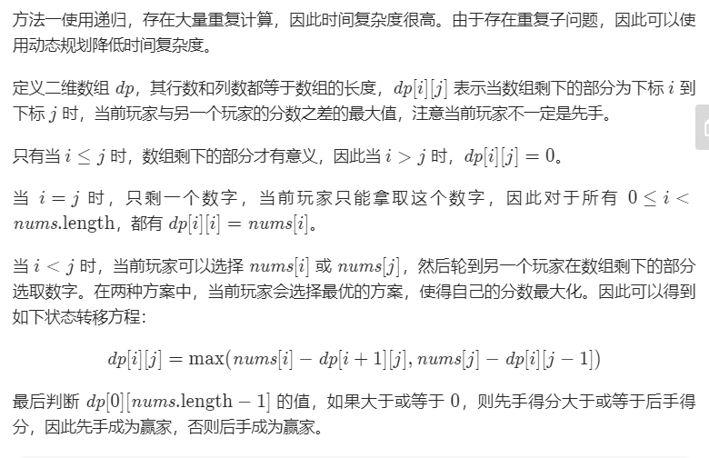

# 486. 预测赢家

## 题目描述
    
    给定一个表示分数的非负整数数组。 玩家 1 从数组任意一端拿取一个分数，随后玩家 2 继续从剩余数组任意一端拿取分数，然后玩家 1 拿，…… 。每次一个玩家只能拿取一个分数，分数被拿取之后不再可取。直到没有剩余分数可取时游戏结束。最终获得分数总和最多的玩家获胜。

    给定一个表示分数的数组，预测玩家1是否会成为赢家。你可以假设每个玩家的玩法都会使他的分数最大化。

    示例 1：
        输入：[1, 5, 2]
        输出：False
        解释：一开始，玩家1可以从1和2中进行选择。
        如果他选择 2（或者 1 ），那么玩家 2 可以从 1（或者 2 ）和 5 中进行选择。如果玩家 2 选择了 5 ，那么玩家 1 则只剩下 1（或者 2 ）可选。
        所以，玩家 1 的最终分数为 1 + 2 = 3，而玩家 2 为 5 。
        因此，玩家 1 永远不会成为赢家，返回 False 。
    示例 2：
        输入：[1, 5, 233, 7]
        输出：True
        解释：玩家 1 一开始选择 1 。然后玩家 2 必须从 5 和 7 中进行选择。无论玩家 2 选择了哪个，玩家 1 都可以选择 233 。
            最终，玩家 1（234 分）比玩家 2（12 分）获得更多的分数，所以返回 True，表示玩家 1 可以成为赢家。


## 方法一 动态规划

###  思路介绍



### 代码

```python
import math
class Solution:
    def PredictTheWinner(self, nums):
        nums_len = len(nums)
        dp = [[0 for _ in range(nums_len)] for _ in range(nums_len)]
        for i in range(nums_len):
            dp[i][i] = nums[i]
        
        for i in range(nums_len-2,-1,-1):
            for j in range(i+1,nums_len):
                dp[i][j] = max(nums[i]-dp[i+1][j],nums[j]-dp[i][j-1])
        return dp[0][nums_len-1]>=0
        
if __name__ == "__main__":
    
    solution = Solution()
    while 1:
        str1 = input()
        if str1 != "":
            arr = [int(s) for s in str1.split(",")]

            res = solution.PredictTheWinner(arr)
            print(res)
        else:
            break
```