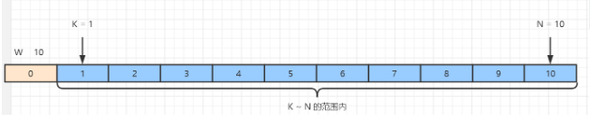
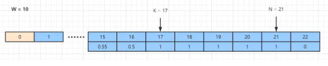

# 837. 新21点

## 题目描述

    爱丽丝参与一个大致基于纸牌游戏 “21点” 规则的游戏，描述如下：

    爱丽丝以 0 分开始，并在她的得分少于 K 分时抽取数字。 抽取时，她从 [1, W] 的范围中随机获得一个整数作为分数进行累计，其中 W 是整数。 每次抽取都是独立的，其结果具有相同的概率。

    当爱丽丝获得不少于 K 分时，她就停止抽取数字。 爱丽丝的分数不超过 N 的概率是多少？

## 示例:
```
  	示例 1：

    输入：N = 10, K = 1, W = 10
    输出：1.00000
    说明：爱丽丝得到一张卡，然后停止。
    示例 2：

    输入：N = 6, K = 1, W = 10
    输出：0.60000
    说明：爱丽丝得到一张卡，然后停止。
    在 W = 10 的 6 种可能下，她的得分不超过 N = 6 分。
    示例 3：

    输入：N = 21, K = 17, W = 10
    输出：0.73278
    提示：

    0 <= K <= N <= 10000
    1 <= W <= 10000
    如果答案与正确答案的误差不超过 10^-5，则该答案将被视为正确答案通过。
    此问题的判断限制时间已经减少。
```

## 思路介绍

### 方法一 动态规划

#### 基本介绍

#### 思路

1. 先判断是否能 100% 赢得游戏

如果手上的点数为 K - 1 时，拿到个最大的数字 W 时，也就是 K - 1 + W 的点数还是没有 N 大，说明肯定能赢得游戏的胜利



2.然后我们就来考虑一般的情况

我们以 N = 21，K = 17，W = 10 来思考。
因为我们的结果是求手上点数为 0 时，赢得游戏的概率。

所以我们需要从后往前逆向求，比如在这里，我们就需要知道在手上点数为 16 时赢得游戏的概率，从而在往前求手上点数为 15 时的概率，最后求出手上点数为 0 时的赢得游戏的概率。

那我们怎么求点数为 16 时赢得游戏的概率呢？

这里我们知道手上点数为 17 时赢得游戏的概率为 100%，所以 K ~ N 区间的赢得游戏的概率为 100%，超过 N 时赢得游戏概率为 0，那么手上点数为 16 时，赢得游戏的概率就是 手上点数为 17 ~ 17 + 10 - 1 的赢得游戏的概率和除以 W，即用一个表达式为 win[16] = sum(win[17] ~ win[26]) / W。

这里我们可以以 O(1) 的时间复杂度计算 sum(win[i + 1] ~ win[i + W + 1])。
我们用一个sumProb = sum(win[17] ~ win[26])
然后每次计算
win[i] = sumProb / W
sumProb = sumProb + win[i] - win[i + k]




#### 复杂度计算

> 时间复杂度：$O(N - K + K) ==> O(N)$

> 空间复杂度：$O(K + W)$

