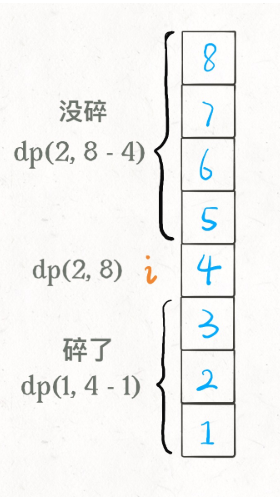

#  887. 鸡蛋掉落

## 题目描述

    你将获得 K 个鸡蛋，并可以使用一栋从 1 到 N  共有 N 层楼的建筑。

    每个蛋的功能都是一样的，如果一个蛋碎了，你就不能再把它掉下去。

    你知道存在楼层 F ，满足 0 <= F <= N 任何从高于 F 的楼层落下的鸡蛋都会碎，从 F 楼层或比它低的楼层落下的鸡蛋都不会破。

    每次移动，你可以取一个鸡蛋（如果你有完整的鸡蛋）并把它从任一楼层 X 扔下（满足 1 <= X <= N）。

    你的目标是确切地知道 F 的值是多少。

    无论 F 的初始值如何，你确定 F 的值的最小移动次数是多少？

## 示例:
```
  	示例 1：

        输入：K = 1, N = 2
        输出：2
        解释：
        鸡蛋从 1 楼掉落。如果它碎了，我们肯定知道 F = 0 。
        否则，鸡蛋从 2 楼掉落。如果它碎了，我们肯定知道 F = 1 。
        如果它没碎，那么我们肯定知道 F = 2 。
        因此，在最坏的情况下我们需要移动 2 次以确定 F 是多少。
    示例 2：

        输入：K = 2, N = 6
        输出：3
    示例 3：

        输入：K = 3, N = 14
        输出：4
     

    提示：

        1 <= K <= 100
        1 <= N <= 10000
```

## 思路介绍

### 方法一 动态规划法

#### 基本介绍

我们选择在第 i 层楼扔了鸡蛋之后，可能出现两种情况：鸡蛋碎了，鸡蛋没碎。注意，这时候状态转移就来了：

如果鸡蛋碎了，那么鸡蛋的个数 K 应该减一，搜索的楼层区间应该从 [1..N] 变为 [1..i-1] 共 i-1 层楼；

如果鸡蛋没碎，那么鸡蛋的个数 K 不变，搜索的楼层区间应该从 [1..N] 变为 [i+1..N] 共 N-i 层楼。



#### 思路

1. 本题应该逆向思维，若你有 K 个鸡蛋，你最多操作 F 次，求 N 最大值。
2. dp[k][f] = dp[k][f-1] + dp[k-1][f-1] + 1;
3. 解释：
   1. dp[k][f]：如果你还剩 k 个蛋，且只能操作 f 次了，所能确定的楼层。
   2. dp[k][f-1]：蛋没碎，因此该部分决定了所操作楼层的上面所能容纳的楼层最大值
   3. dp[k-1][f-1]：蛋碎了，因此该部分决定了所操作楼层的下面所能容纳的楼层最大值
4. 又因为第 f 次操作结果只和第 f-1 次操作结果相关，因此可以只用一维数组。


#### 复杂度计算

> 时间复杂度：$O(K \sqrt{n})$

> 空间复杂度：O(K)

