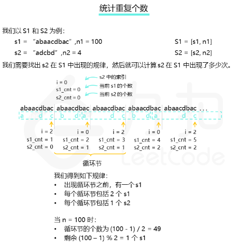

# 387. 字符串中的第一个唯一字符

## 题目描述

        给定一个字符串，找到它的第一个不重复的字符，并返回它的索引。如果不存在，则返回 -1。

## 示例:
```
    案例:

        s = "leetcode"
        返回 0.

        s = "loveleetcode",
        返回 2.
```

## 思路介绍

### 方法一：找出循环节

#### 题目解析

由于题目中的 n1 和 n2 都很大，因此我们无法真正把 S1 = [s1, n1] 和 S2 = [s2, n2] 都显式地表示出来。由于这两个字符串都是不断循环的，因此我们可以考虑找出 s2 在 S1 中出现的循环节，如果我们找到了循环节，那么我们就可以很快算出 s2 在 S1 中出现了多少次了。

有些读者可能对循环节这个概念会有些陌生，这个概念我们可以类比无限循环小数，如果从小数部分的某一位起向右进行到某一位止的一节数字「循环」出现，首尾衔接，称这种小数为「无限循环小数」，这一节数字称为「无限循环小数」。比如对于 3.56789789789... 这个无限循环小数，它的小数部分就是以 789 为一个「循环节」在无限循环，且开头可能会有部分不循环的部分，这个数字中即为 56。

那么回到这题，我们可以将不断循环的 s2 组成的字符串类比作上面小数部分，去找是否存在一个子串，即「循环节」，满足不断在 S2 中循环，且这个循环节能对应固定数量的 s1 。如下图所示，在第一次出现后，S2 的子串 bdadc 构成一个循环节：之后 bdadc 的每次出现都需要有相应的两段 s1。



当我们找出循环节后，我们即可知道一个循环节内包含 s1 的数量，以及在循环节出现前的 s1 的数量，这样就可以在 O(1) 的时间内，通过简单的运算求出 s2 在 S1 中出现的次数了。当然，由于 S1 中 s1 的数量 n1 是有限的，因此可能会存在循环节最后一个部分没有完全匹配，如上图最后会单独剩一个 s1 出来无法完全匹配完循环节，这部分我们需要单独拿出来遍历处理统计。

有些读者可能会怀疑循环节是否一定存在，这里我们给出的答案是肯定的，根据鸽笼原理，我们最多只要找过 |s2| + 1 个 s1，就一定会出现循环节。


#### 思路

1. 设计一个哈希表 recall ：哈希表 recall 以 s2 字符串的下标 index 为索引，存储匹配至第 s1cnt 个 s1 的末尾，当前匹配到第 s2cnt 个 s2 中的第 index 个字符时， 已经匹配过的s1 的个数 s1cnt 和 s2 的个数 s2cnt 。

2. 我们在每次遍历至 s1 的末尾时根据当前匹配到的 s2 中的位置 index 查看哈希表中的对应位置，如果哈希表中对应的位置 index 已经存储元素，则说明我们找到了循环节。循环节的长度可以用当前已经匹配的 s1 与 s2 的数量减去上次出现时经过的数量（即哈希表中存储的值）来得到。

3. 然后我们就可以通过简单的运算求出所有构成循环节的 s2 的数量，对于不参与循环节部分的 s1，直接遍历计算即可

   
#### 复杂度计算

> 时间复杂度：O(∣s1∣∗∣s2∣)

> 空间复杂度：O(|s2|)

