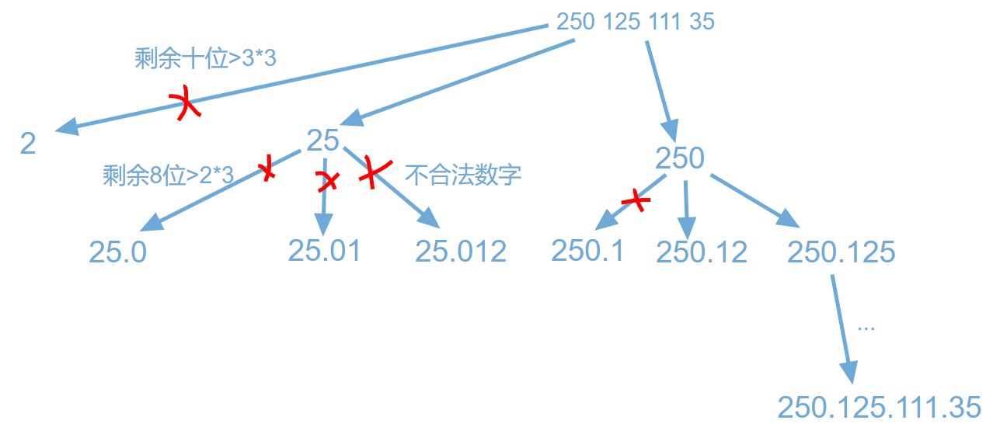

#  93. 复原IP地址
    
给定一个只包含数字的字符串，复原它并返回所有可能的 IP 地址格式。

有效的 IP 地址 正好由四个整数（每个整数位于 0 到 255 之间组成，且不能含有前导 0），整数之间用 '.' 分隔。

例如："0.1.2.201" 和 "192.168.1.1" 是 有效的 IP 地址，但是 "0.011.255.245"、"192.168.1.312" 和 "192.168@1.1" 是 无效的 IP 地址。

示例 1：

    输入：s = "25525511135"
    输出：["255.255.11.135","255.255.111.35"]

示例 2：

    输入：s = "0000"
    输出：["0.0.0.0"]

示例 3：

    输入：s = "1111"
    输出：["1.1.1.1"]

示例 4：

    输入：s = "010010"
    输出：["0.10.0.10","0.100.1.0"]

示例 5：

    输入：s = "101023"
    输出：["1.0.10.23","1.0.102.3","10.1.0.23","10.10.2.3","101.0.2.3"]

## 思路介绍

### 方法一 回溯法

#### 1. 背景知识

- 有效的 IP 地址 的条件
  - 由**四个整数**（**每个整数位于 0 到 255 之间**组成，且**不能含有前导 0**）；
  - **整数之间用 '.' 分隔**。
- 举例：
  - 0.0.0.0 - 255.255.255.255

#### 2. 四个关键点

- 剪枝:
  - 条件 1. 每个整数位于 0 到 255 之间；（error : 255.555 ）
  - 条件 2. 不能含有前导 0；（error : 255.05 ）
  - 条件 3. 段位里有非正整数字符不合法；（error : 255.0@ ）

- 结果：
  - 整数之间用 '.' 分隔；(255.255.255.255)
  - 四个整数 组成； (255.255.255.255)
  
#### 3. 路演



[画板地址](https://shimo.im/boards/QQCrGd6vrC9rtqkP)

#### 4. 回溯 函数 定义

```s
    def dfs(self,s,s_len,split_times,begin,path,res):
        pass
```

1. s：字符串；
2. s_len : 字符串长度，用于 判断终止条件；
3. split_times：分割次数，用于 判断终止条件；
4. begin：每轮的开始位置，需要从 begin 开始，选取 1位、2位、3位数；
5. path：当前路径；
6. res：最终返回结果

#### 5. 思路

1. 判断字符串 长度 是否 在 [5,12]，如果 字符串 长度 不在这个区间，可以直接 return;
2. 回溯法：
   1. 判断终止条件：指针begin 遍历完字符串？
      1. 是，判断是否为可行域：分割次数为4？
         1. 添加到结果
      2. 否
         1. 剪枝操作：判断 剩余长度 是否 在 [(4-split_times),3*(4-split_times)]
         2. 遍历所有可能：因为 每一个地址单元 长度 在 [0,255]，所以 每 1-3 为一个 单元：
            1. 验证 是否 符合要求： 约束条件 2-3；
               1. 当前值 添加到 当前路径；
               2. 回溯；
               3. 弹出 最上层 值；

#### 6. 代码介绍

```s
    class Solution:
        def restoreIpAddresses(self, s: str) -> List[str]:
            s_len = len(s)
            res = []
            # step 1：判断字符串 长度 是否 在 [5,12]
            if s_len<4 or s_len >12:
                return res 
            # step 2：回溯法
            path = []
            self.dfs(s,s_len,0,0,path,res)
            return res
        # 功能：回溯法
        def dfs(self,s,s_len,split_times,begin,path,res):
            # begin 指针 移动 到 尾部
            if begin==s_len:
                # 判断 分割次数 是否 等于 4
                if split_times==4:
                    res.append(".".join(path))
                return 
            # 判断 剩余长度 是否 在 [(4-split_times),3*(4-split_times)]
            if s_len-begin<(4-split_times) or s_len-begin>3*(4-split_times):
                return
            # 因为 每一个地址单元 长度 在 [0,255]，所以 每 1-3 为一个 单元
            for i in range(3):
                if begin+i>=s_len:
                    break
                now_seg = self.valid(begin,begin+i,s)
                if now_seg!=-1:
                    path.append(str(now_seg))
                    self.dfs(s,s_len,split_times+1,begin+i+1,path,res)
                    path.pop()
        # 功能：验证 字符串 是否合格 函数，即 [0,255] 内
        def valid(self, left,right,s):
            num = 0
            for i in range(left,right+1):
                if left!=right and s[left]=="0":
                    return -1
                num = num*10+int(s[i])
                if num>255:
                    return -1
            return num
```

#### 7. 复杂度计算

- 时间复杂度：$O(3^(seg_count)*|s|)$。因为 IP 地址每一段的位数都不超过3，所以只有三种可能【1位、2位、3位】，故递归的时间复杂度为 $O(3^(seg_count))$；对于 每个可行 IP 地址，我们需要 O(|s|) 的时间将其加入 结果 res 中；
- 空间复杂度：$O(seg_count)$。由于这个问题限制在有效 IP 段内，树最多 4 层，保存的结果集也是有限个，基于一般性，需要记录递归过程的信息，这个空间大小是递归树的高度 h。
> 注：seg_count 为 段数，这里默认为 4