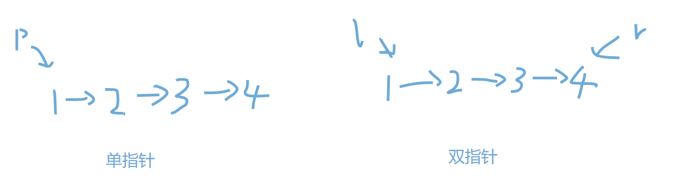

# 【关于 Leetcode 刷题篇 之 双指针总结】那些你不知道的事
> 作者：杨夕
> 
> 项目地址：https://github.com/km1994/leetcode/tree/master/topic8_binary_search
> 
> 个人介绍：大佬们好，我叫杨夕，该项目主要是本人在刷题过程中，所见、所思、所想、所闻，可能存在一些理解错误，希望大佬们多多指正。

## 目录

- [【关于 Leetcode 刷题篇 之 双指针总结】那些你不知道的事](#关于-leetcode-刷题篇-之-双指针总结那些你不知道的事)
  - [目录](#目录)
  - [一、什么是双指针？](#一什么是双指针)
    - [1.1 单指针](#11-单指针)
    - [1.2 双指针](#12-双指针)
  - [二、双指针有哪些呢？](#二双指针有哪些呢)
    - [2.1 类别](#21-类别)
    - [2.2 左右指针](#22-左右指针)
    - [2.3 快慢指针](#23-快慢指针)
    - [2.4 固定间距指针](#24-固定间距指针)
    - [2.5 等步长指针 【典型的双指针】](#25-等步长指针-典型的双指针)

## 一、什么是双指针？



### 1.1 单指针

- 介绍：利用一个指针遍历所有项
- 代码介绍：
```s
for i in range(nums):
    dothing()
```

### 1.2 双指针
- 介绍：利用两个指针遍历所有项【常用的是左右指针如下图】
- 代码介绍：
```s
l = 0
r = nums_len -1
while l<r:
    doThing()
    l = l+1
    r = r-1
```

## 二、双指针有哪些呢？

### 2.1 类别

1. 左右指针
2. 快慢指针
3. 固定间距指针
4. 等步长指针

### 2.2 左右指针

- 特点：
  - 两个指针步长不确定
  - 两个指针分别指向头尾，并往中间移动
- 典型题目：
  - 二分查找
  - 快排
- 伪代码
```s
l = 0
r = nums_len -1
while l<r:
    doThing()
    l = l+1
    r = r-1
```

### 2.3 快慢指针

- 特点：
  - 两个指针步长不相同
  - 两个指针可以从同一个方向
- 举例：两个在操场上快跑慢跑的人一定会相遇
- 典型题目：
  - 141. 环形链表
  - 287. 寻找重复数
  - 26. 删除排序数组中的重复项
- 伪代码
```s
l = 0
r = 0
while 没有遍历完
  if 一定条件
    l += 1
  r += 1
return 合适的值
```

### 2.4 固定间距指针

- 特点：
  - 两个指针步长确定
  - 第一个指针先跑一段距离之后，第二个指针再跑
- 典型题目：
  - 一次遍历（One Pass）求链表的中点
  - 一次遍历（One Pass）求链表的倒数第 k 个元素
  - 固定窗口大小的滑动窗口
- 伪代码
```s
l = 0
r = k
while 没有遍历完
  自定义逻辑
  l += 1
  r += 1
return 合适的值
```

### 2.5 等步长指针 【典型的双指针】

- 特点：
  - 两个指针步长确定
  - 两个指针一起跑，可以在不同赛道上跑
  - 指针移动是连续的
- 典型题目：
  - 21. 合并两个有序链表
  - 88. 合并两个有序数组

