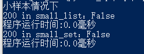
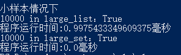
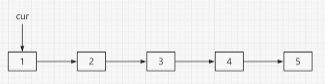
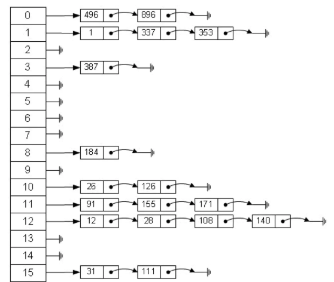

# 【关于Leetcode刷题篇之哈希表总结】那些你不知道的事

> 作者：杨夕 <br/>
> 项目地址：https://github.com/km1994/leetcode/tree/master/topic9_hash_table <br/>
> 个人介绍：大佬们好，我叫杨夕，该项目主要是本人在刷题过程中，所见、所思、所想、所闻，可能存在一些理解错误，希望大佬们多多指正。 <br/>


## 动机

- 场景：

> 假设 你要 读取 一个 文件中，然后查询里面是否 某个数，请问你会采用的方法是什么？

> 假设 从 区间 [1,200] 内查询 某个数




> 假设 从 区间 [1,100000] 内查询 某个数



- 介绍：可以看出在小数据集下，列表和哈希表查询效率差异不大，但是当 数据 上万时，列表的查询效率将 变得低效。


## 解析

### 列表

- 其结构如下：



- 查询方式：从头一个个 比较，直到匹配到结果，返回结果，否则返回 False；
- 查询复杂度：
  - 时间：O(N)

### 哈希表

- 方法：使用某种算法操作(散列函数)将键转化为数组的索引来访问数组中的数据，这样可以通过Key-value的方式来访问数据，达到常数级别的存取效率。
- 其结构如下【以拉链法为例】：



- 查询复杂度：
  - 时间：O(1)

## 应用场景

### 应用场景一 提供更多信息

#### 介绍

- 场景介绍：题目要求返回更多的信息，比如对于一个 数组，你不仅需要判断 给定值 是否 存在于 数组中，你还需要返回其对应的索引
- 解决方式：利用 哈希表 建立 值 到 键 间的映射关系


#### 代码示例

```s
    # 读取大文件
    large_file = "large.txt"
    large_list = []
    large_dict = dict()
    with open(large_file,"r",encoding="utf-8") as f:
        line = f.readline()
        while line:
            large_list.append(int(line))
            large_dict[int(line)] = len(large_list) 
            line = f.readline()

    key = 3000
    # 利用 列表 查询 3000 的 索引
    for i in range(len(large_list)):
        if key == large_list[i]:
            print(f"Use list select {key} key is {i+1}")
            break

    # 利用 哈希表 查询 3000 的 索引
    print(f"Use Dict select {key} key is {large_dict[key]}")
```


#### 例题讲解

##### leetCode 205. 同构字符串

- 题目：
  
给定两个字符串 s 和 t，判断它们是否是同构的。

如果 s 中的字符可以被替换得到 t ，那么这两个字符串是同构的。

所有出现的字符都必须用另一个字符替换，同时保留字符的顺序。两个字符不能映射到同一个字符上，但字符可以映射自己本身。

示例 1:

```s
    输入: s = "egg", t = "add"
    输出: true
```

示例 2:
```s
    输入: s = "foo", t = "bar"
    输出: false
```

示例 3:
```s
    输入: s = "paper", t = "title"
    输出: true
```

说明:你可以假设 s 和 t 具有相同的长度。


- 解析

定义一个 哈希表 dic 用于 存储 s 中每个字符 所对应 的 t 中 对应位置的字符

- 代码

```s
class Solution():
    def isIsomorphic(self,s,t):
        s_len = len(s)
        t_len = len(t)
        if s_len!=t_len:
            return False
        dic = {}
        for i in range(s_len):
            if s[i] in dic and dic[s[i]]!=t[i]:
                return False
            else:
                dic[s[i]]=t[i]
        return True 

solution = Solution()
print(f"egg and add is Isomorphic:{solution.isIsomorphic('egg','add')}")   
print(f"foo and bar is Isomorphic:{solution.isIsomorphic('foo','bar')}")   
print(f"paper and title is Isomorphic:{solution.isIsomorphic('paper','title')}")   
```

### 应用场景二 按键聚合或计数

#### 介绍

- 场景介绍：对于一个 数组，我们需要找出 其中 只出现过一次的 数值
- 解决方式：利用 哈希表 对 数组中每一个 数值 进行计数，最后返回 只才能一次的 数值


#### 例题讲解

##### 217. 存在重复元素

- 题目

给定一个整数数组，判断是否存在重复元素。

如果任意一值在数组中出现至少两次，函数返回 true 。如果数组中每个元素都不相同，则返回 false 。

```s
    示例 1:
        输入: [1,2,3,1]
        输出: true
    示例 2:
        输入: [1,2,3,4]
        输出: false
    示例 3:
        输入: [1,1,1,3,3,4,3,2,4,2]
        输出: true
```

- 解析
  - 这道题的目标：判断是否存在重复元素

- 思路：

1. 定义一个 hash 表；
2. 遍历数组，并判断当前值是否在 hash 表中：
   1. 是，表明 数组存在重复数，return True;
   2. 否，将 元素 加入 hash 表中；
3. 直到遍历结束，return False;

- 代码

```s
class Solution:
    def containsDuplicate(self, nums: List[int]) -> bool:
        # step 1 : 定义一个记忆 hash 表
        memory_set = set()
        # step 2 : 遍历数组
        for num in nums:
            # step 3：找到重复数
            if num in memory_set:
                return True
            else:
                memory_set.add(num)
        # step 4：未找到重复数
        return False
```

- 复杂度分析：
  - 时间：O(n*1)，用于 需要遍历数组，所以 时间复杂度为 O(n)，因为 hash 表判断是否存在，所以 时间复杂度 为 O(1);
  - 空间：O(n)，定义了一个 hash 表；

## 参考资料

1. [leetCode. 哈希表专题(3)](https://zhuanlan.zhihu.com/p/58938611)